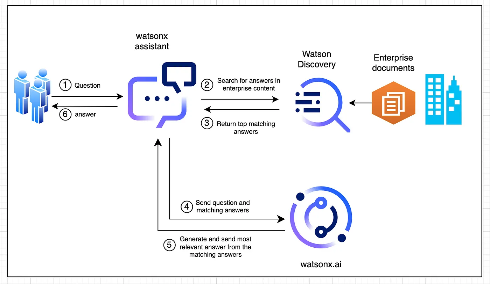

# Generative AI

#### What is it?

Generative AI refers to the aspect of artificial intelligence technology that focuses on generating new content, from text to images and beyond, based on the training data it has been fed and current inputs it receives.

#### Why is it used?

In this project, generative AI is crucial for crafting responses that are both contextually relevant and linguistically coherent, making interactions with the chatbots more natural and engaging for users.

## LLMs

Large Language Models (LLMs) are a type of generative AI used to process and generate human-like text. They utilize vast amounts of data and sophisticated algorithms to understand and produce language in a way that mimics human conversation.

## RAG

### What is it?

Retrieval Augmented Generation (RAG) combines the power of information retrieval and language generation technologies. By integrating search results into the generative process, RAG allows AI models to produce more accurate, informative, and contextually relevant responses based on a wide range of external data sources.

#### Why is it used?

RAG is used to enhance the chatbot's ability to handle complex queries by fetching relevant data in real-time and generating responses that are not just based on fixed patterns or the model's pre-existing knowledge, but also on specific, current information retrieved during the interaction.

#### IBM Reference Material
[Generative AI](https://www.ibm.com/watsonx?utm_content=SRCWW&p1=Search&p4=43700078376398807&p5=b&p9=58700008586718912&gclid=CjwKCAjwi_exBhA8EiwA_kU1MvuVGpaXUAxlZh-oCtf_lw34bCdrSRx8xmbiAZUz4gTjed7NaSgI4xoCbYsQAvD_BwE&gclsrc=aw.ds)

[What is retrieval-augmented generation?](https://research.ibm.com/blog/retrieval-augmented-generation-RAG)

IBM RAG Architecture Diagram 

