# watsonx Assistant Integrations

## Overview

Below you can follow a step-by-step walkthrough of how to integrate watsonx Assistant with Watson Discovery and watsonx.ai. These integrations will allow you to utilize your knowledge base in Watson Discovery and use watsonx.ai LLMs to receive natural language responses.

## Create Custom watsonx.ai Extension in watsonx Assistant

### **Step 1: Download OpenAPI File**

First, download the `watsonx-openapi.json` OpenAPI file with the button below.

[OpenAPI File](https://raw.githubusercontent.com/watson-developer-cloud/assistant-toolkit/master/integrations/extensions/starter-kits/language-model-watsonx/watsonx-openapi.json){ .md-button .md-button--primary }

### **Step 2: Build Custom Extension**

1. Navigate back to your Watsonx Assistant to the Integrations page.
   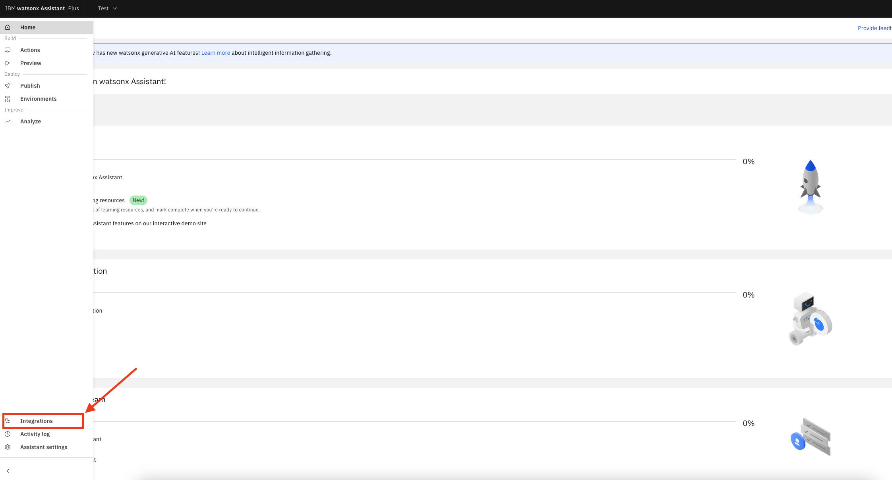

2. Scroll back down and click on the **Build custom extension** button.
   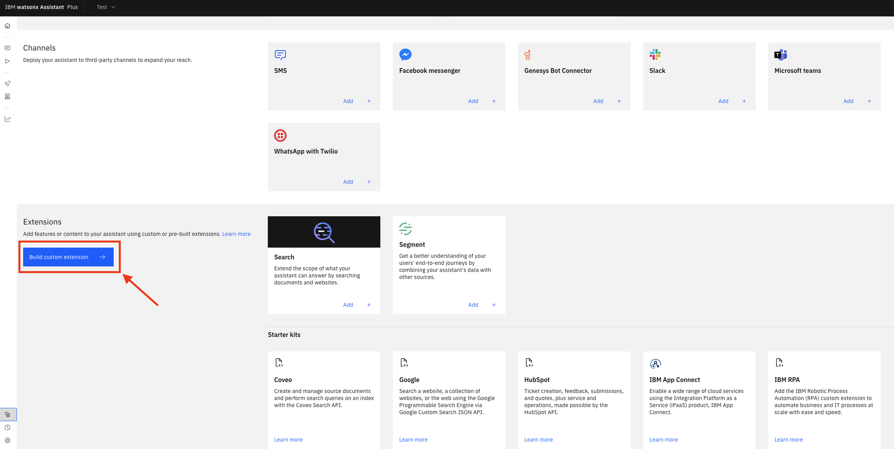

3. Click **Next** and give the extension a name and description. Click **Next** and then upload the OpenAPI file you downloaded from the GitHub repository.
   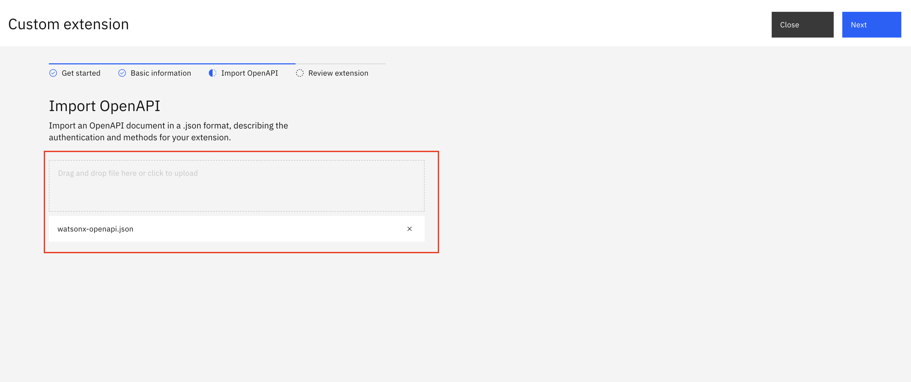

4. Click **Next** and then **Finish**. You should now see a Watsonx.ai custom extension. Click **Add**.
   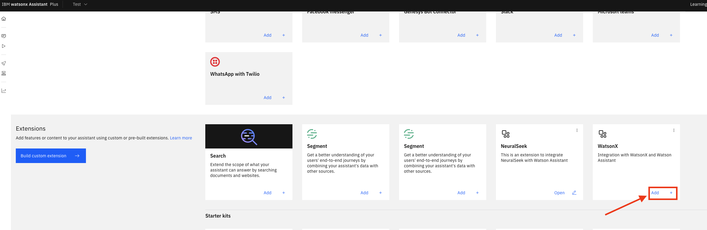

### **Step 3: Authenticate Custom Extension**

#### **Retrieve API Key**

1. Click **Add** again and **Next**. From the **Authentication type** drop-down select **OAuth 2.0**. To get this API key go to [IBM Cloud](https://cloud.ibm.com/) and click on the **Manage** drop-down on the top navigation bar and select **Access (IAM)**.  
   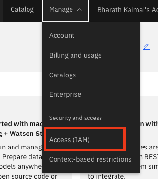

2. Click on **API keys** on the left and create an API key. Make sure you save the API key for future use because you will not be able to view the API key again.

3. Go back to the Watsonx Assistant page and paste that API key in the text box. Click **Next** and **Finish**. Your custom Watsonx.ai extension has now been created.

## Create Custom Watson Discovery Extension in watsonx Assistant

### **Step 1: Download OpenAPI File**

1. Download the `watson-discover-query-openapi.json` OpenAPI file with the button below.

[OpenAPI File](https://raw.githubusercontent.com/watson-developer-cloud/assistant-toolkit/master/integrations/extensions/starter-kits/watson-discovery/watson-discovery-query-openapi.json){ .md-button .md-button--primary }

### **Step 2: Build Custom Extension**

1. Then, navigate to the `Integrations` tab on your Watsonx Assistant page.
   

2. Scroll down and click on the **Build custom extension** button.
   

3. Click **Next** and then name the extension “Watson Discovery.” Click **Next** again and then upload the OpenAPI json file that you previously downloaded from the GitHub repository.
   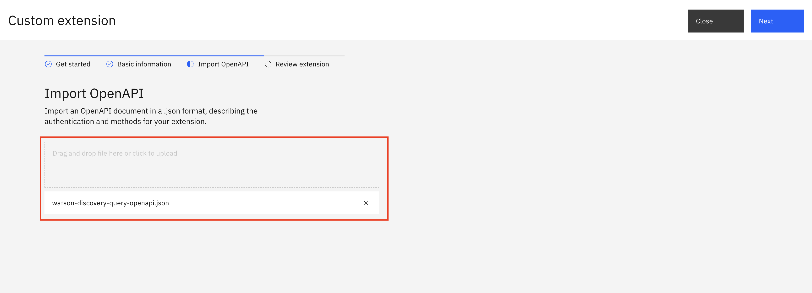

4. Click **Next** and then **Finish**. You should now see a `Watson Discovery` tile. Click **Add**.
   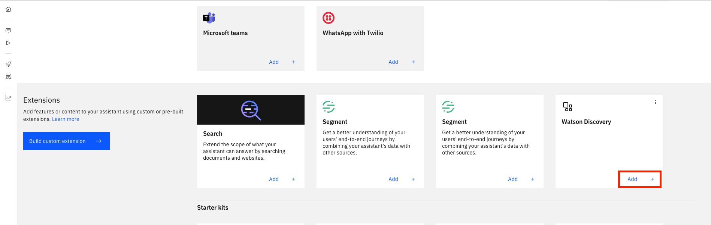

### **Step 3: Authenticate Custom Extension**

1.  Click **Add** again and then **Next**. On the authentication page, select **Basic auth** for the authentication type. You will then need to input 3 pieces of information:

    - _username_
    - _password_
    - _discovery URL_

    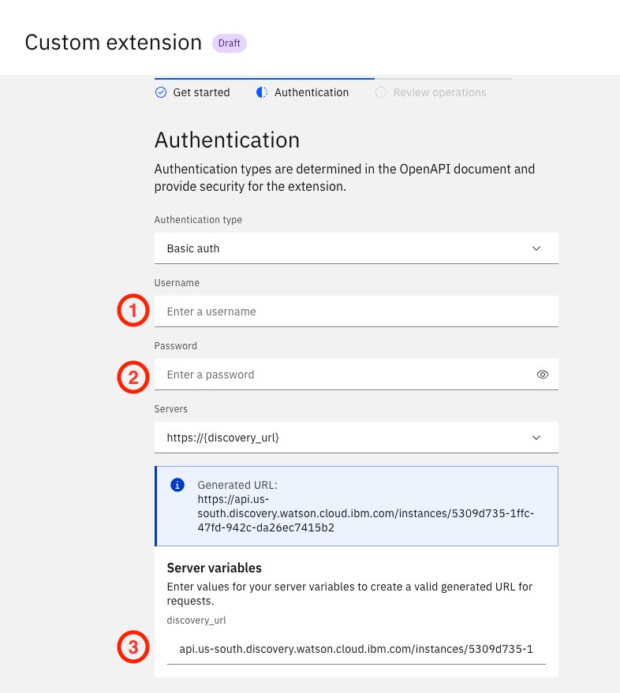

2.  Under username you can input `apikey`

#### **Retrieve API Key and Discovery URL**

3.  For the `password` and `discovery URL`, you will need to navigate to your `Watson Discovery` instance. Go to your [IBM Cloud](https://cloud.ibm.com/) account, click on the hamburger menu in the top left, and click on **Resource List**.

    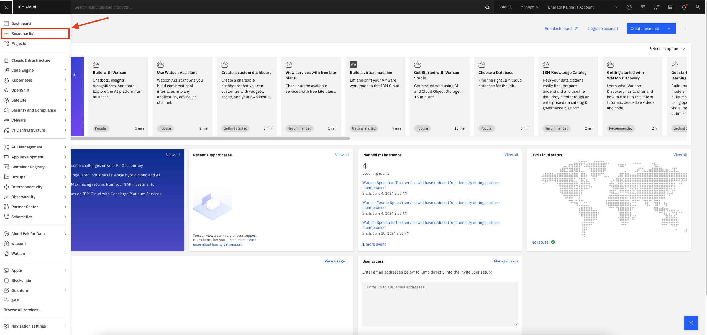

4.  Open up the AI/Machine Learning section and click on your discovery instance and you should see this page.

    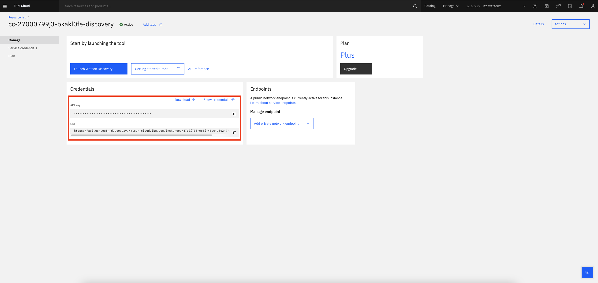

5.  Copy both the _API key_ and _URL_ and paste it on the extensions page of your watsonx Assistant instance. Paste the API key into the password text box and paste the URL in the discovery URL text box at the bottom of the page

- _Make sure that when you paste the URL into the discovery URL text box that you take out the ”https://” part of the URL_.

6. Click **Next**, **Finish**, and **Close**. Our last step to complete the watsonx Assistant integration with watsonx.ai and Watson Discovery will require us to create and configure some actions.

## Configure Discovery/watsonx.ai Actions

### **Step 1: Download Actions JSON File**

1. Download the `discovery-watsonx-actions.json` file from the button below.

[Actions JSON file](https://github.com/watson-developer-cloud/assistant-toolkit/tree/master/integrations/extensions/starter-kits/language-model-conversational-search){ .md-button .md-button--primary }

### **Step 2: Upload Actions JSON File to Assistant**

1.  Go back to the watsonx Assistant page and navigate to the Actions tab from the menu on the left.

    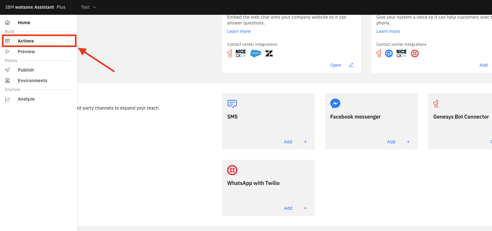

2.  Click on the Settings icon in the top right corner.

    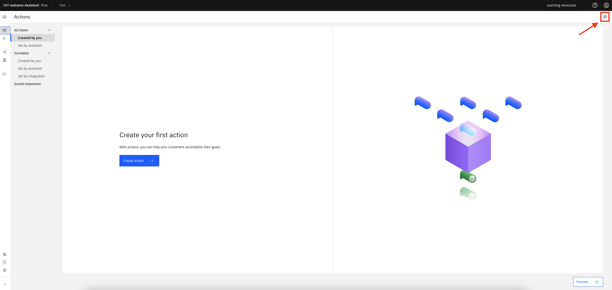

3.  Navigate to the **Upload/Download** tab and click on the box under _Upload_ to upload the file you just downloaded from GitHub. Then, click the blue **Upload** button and the **Upload and replace** button. Finally, click **Close** in the top right.

    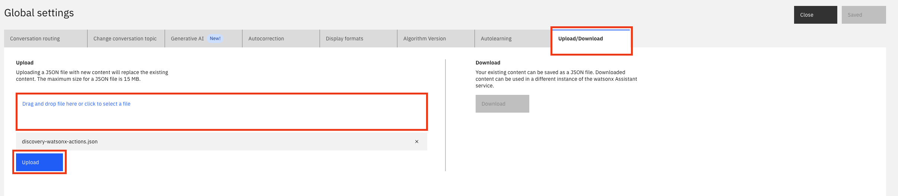

4.  You should now see 3 actions created for you from the json file you just uploaded: _Generate Answer_, _Invoke watsonx generation API_, and _Search_.

    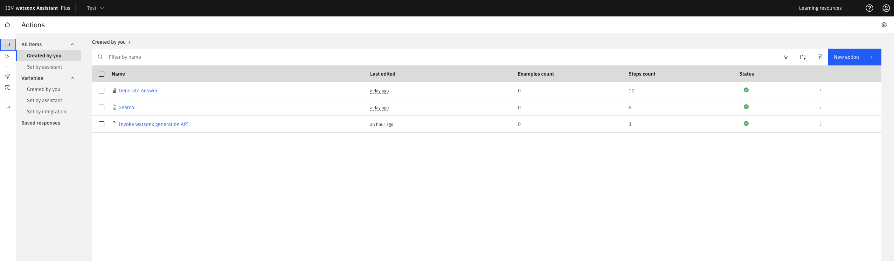

You'll see a red status symbol for both the **Invoke watsonx generation API** and **Search** actions. We'll need to go into each action and fix the errors. Before we do that, let's go set some values for some of the variables created.

### **Step 3: Set Session Variables**

1. On the left hand side under **Variables** click on **Created by you**.

   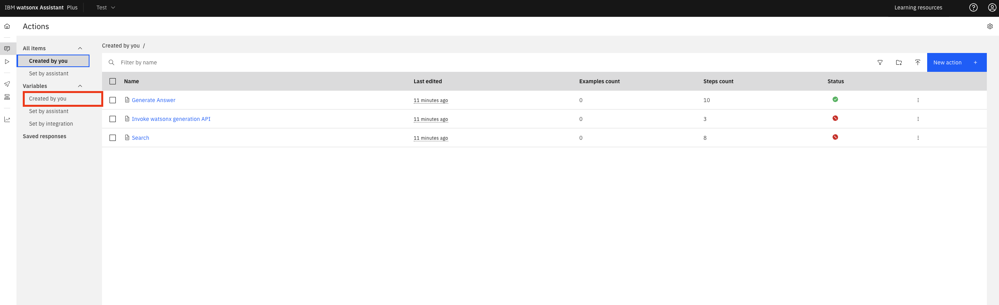

There's 2 variables that we want to change: _discovery_project_id_ and _watsonx_project_id_.

#### **Retrieve Discovery Project ID**

2.  Let's click on **discovery_project_id**. To get the project ID, navigate to your Watson Discovery instance. Select your project that includes the documents/information needed and navigate to the **Integrate and Deploy** page from the menu on the left.

    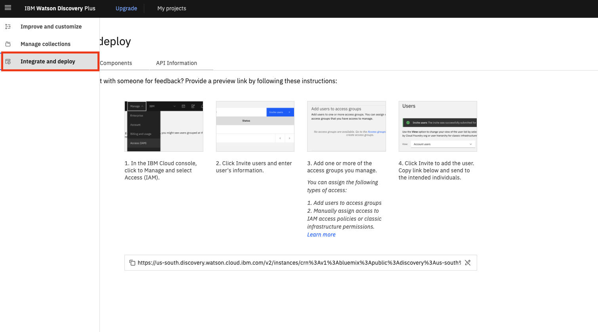

3.  Go to the **API information** tab and copy the **Project ID**.

    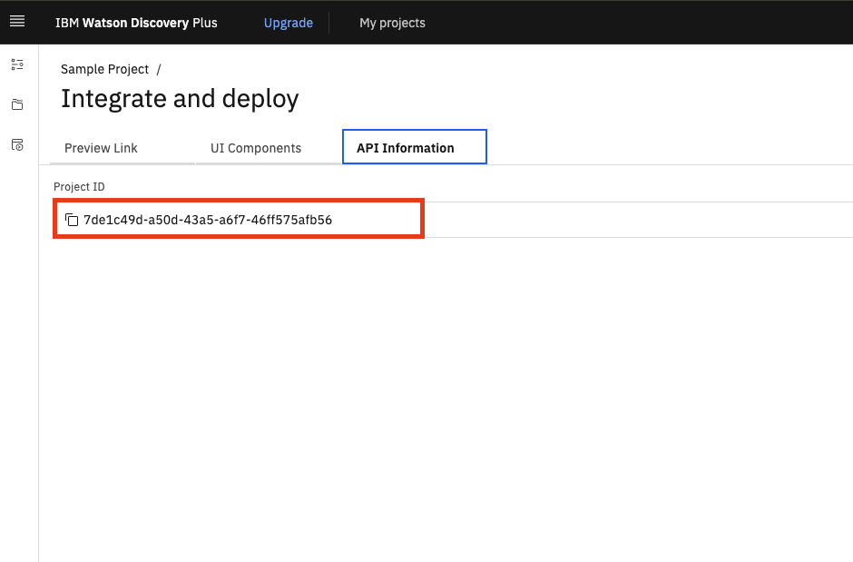

4.  Now, go back to your watsonx Assistant instance and paste the project ID in the **Initial value** text box. Click **Save**.

    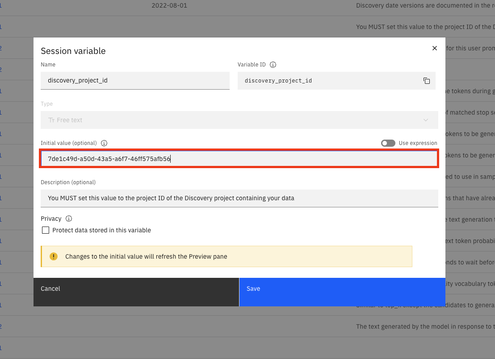

#### **Retrieve watsonx Project ID**

5.  Now, let's click on **watsonx_project_id**. To get this, navigate to your watsonx instance and select the project you created. Under the **Manage** tab you should be able to find the **project ID**. Copy that and go back to the watsonx Assistant page.

    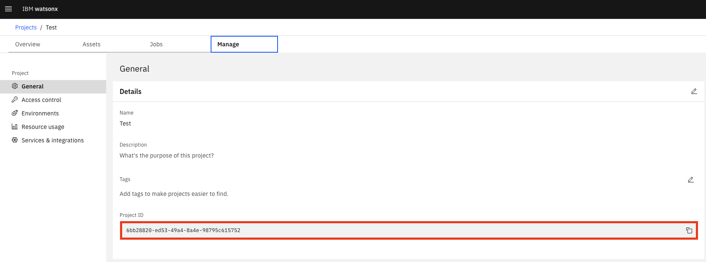

6.  Paste this value into the **Initial value** box similar to what you did for the discovery project ID. Click **Save**.

    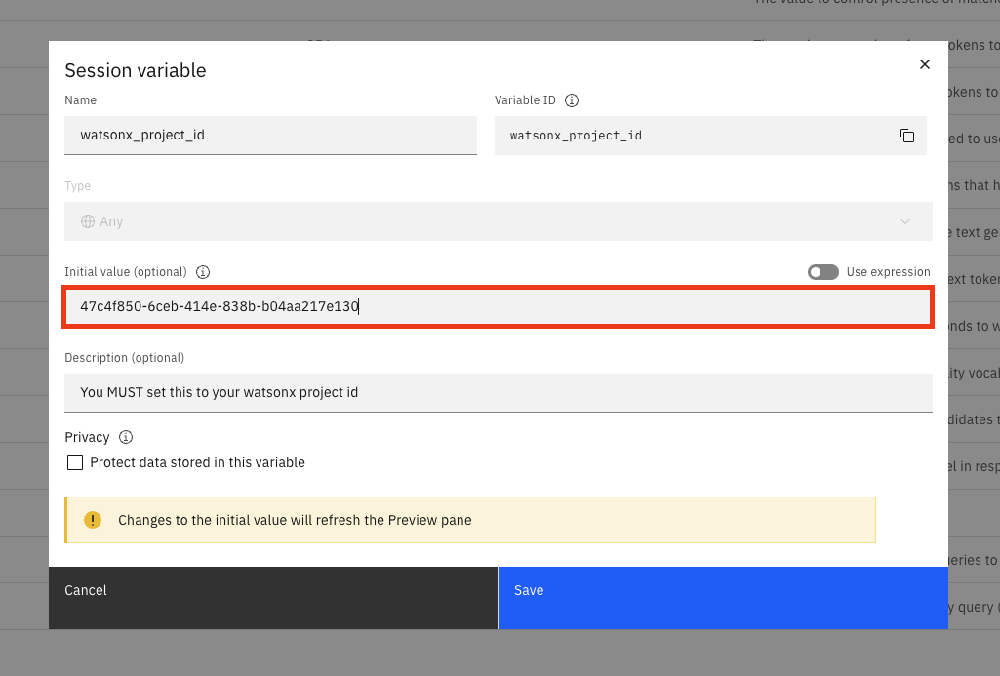

Now that we've set these variables, let's go back to our actions.

### **Step 4: Configure Actions**

1. This can be found if you click **Created by you** under **All items**.

#### **_Search_**

2.  Let's step into the **Search** action first. Click on **Search**.

3.  You'll see that step 5 on the left hand side is red. Click on that step. you should see a message that _Extension not fully configured_.

    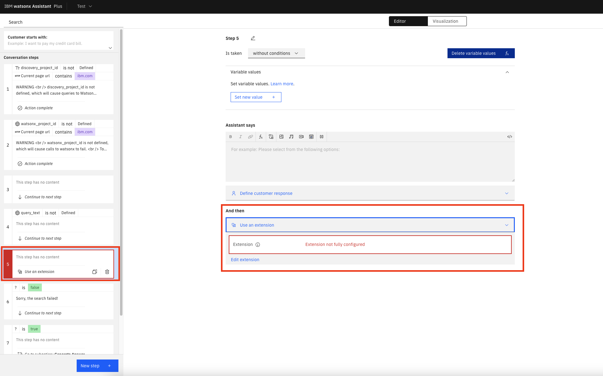

4.  Let's click on **Edit extension** under that message.

5.  For the extension, we're going to use our Watson Discovery extension. And we're going to use the **Query a project** operation.

6.  We should see 2 parameters for this operation: _version_ and _project_id_. We're going to set **version** to **discovery_date_version** and set **project_id** to **discovery_project_id**. To reach these values to set the parameters to, click on the drop down box to the right of _To_ and click on **Session variables**. You should be able to find both _discovery_date_version_ and _discovery_project_id_. Once those 2 parameters have been set, click **Apply**.

    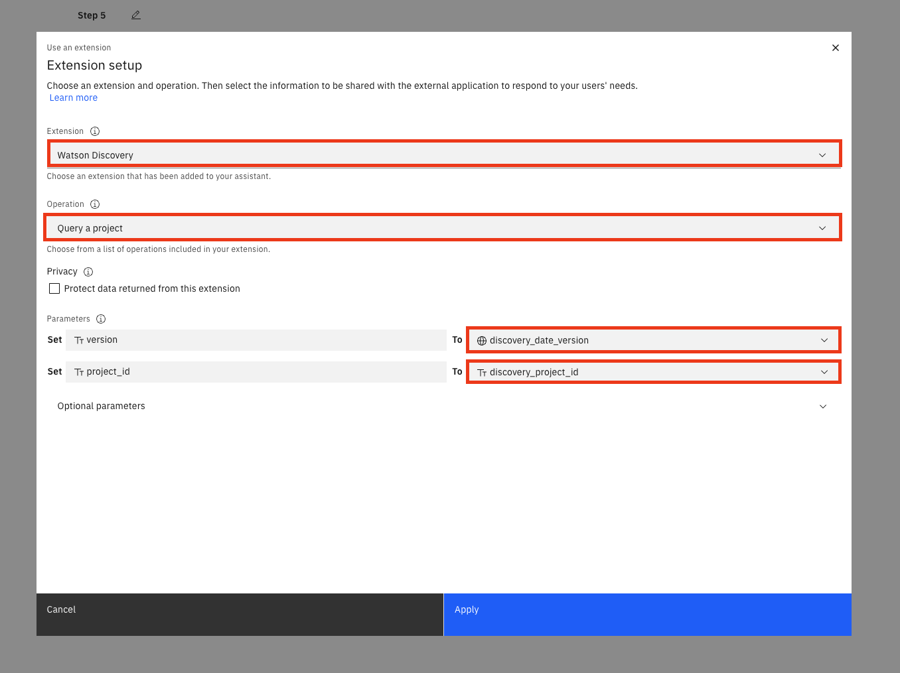

7.  Make sure to save by clicking the save icon in the top right. Then, exit by clicking the X in the top right as well.

#### **_Invoke watsonx generation API_**

8.  Now, let's go into the **Invoke watsonx generation API** action.

9.  You'll see that step 1 is red. Go ahead and click on that. You'll see that there's the same error messages as the other action.

    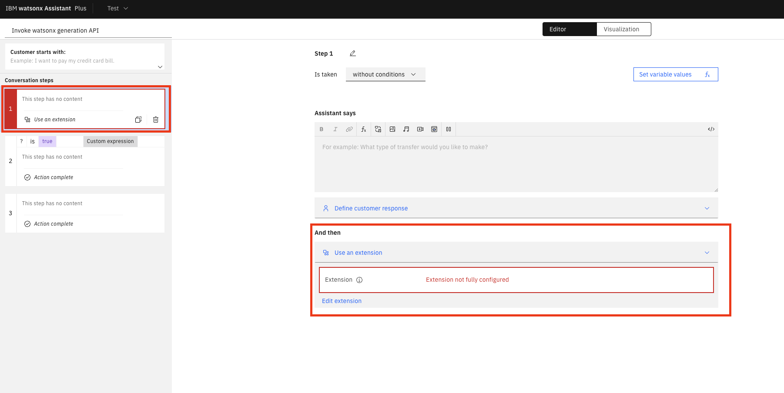

10. Click on **Edit extension**.

11. This time for the extension, we're going to use our watsonx.ai extension. And then we're going to use the **Generation** operation.

12. You should see 4 parameters that we need to set. Set **version** to **watsonx_api_version**, **input** to **model_input**, **model_id** to **model_id**, and **project_id** to **watonsx_project_id**. All of these values can be found under _session variables_ similar to before. Finally, click **Apply**.

    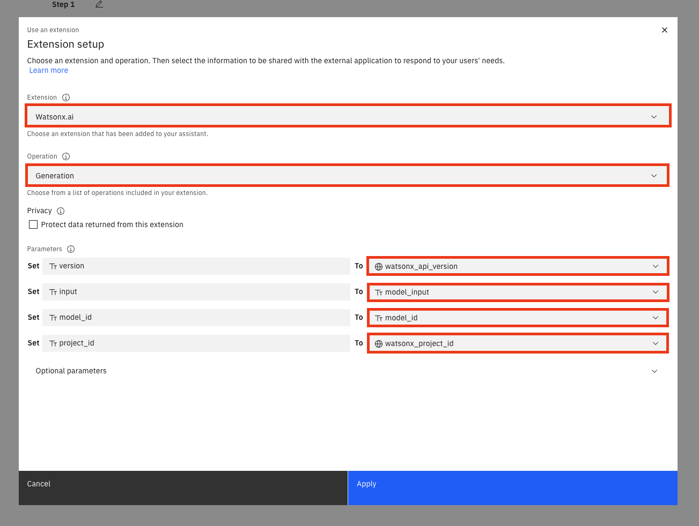

13. Make sure to save by clicking the save icon in the top right. Then, exit by clicking the X in the top right as well.

### **Optional: Configure LLM Model**

If you wanted to play around with/test different models with watsonx.ai, all you need to do is go back to the variables **Created by you** page. The variable **model_id** is the one that denotes which model to use. So, if you edit that to include the provider and model version (ex. IBM and granite-13b-chat-v2) you will be able to use that model.
