# Watson Discovery Essentials

## Overview

IBM Watson Discovery is an AI-powered search and text analytics engine that helps you find valuable insights in your documents and data. Whether you are analyzing reports, extracting information from contracts, or conducting research, Watson Discovery can help you get answers quickly and efficiently. IBM Watson Discovery comprises several components that work together to enhance data analysis and search capabilities:

## Components

* **Projects**: These are the spaces where you can import different types of data from various sources to query for insights or answers.

* **Collections**: This refers to the sets of documents that you upload or crawl from a connected data source. Here, unstructured text is organized into fields like author, file type, and text.

* **Fields**: These are specific attributes or metadata extracted from your documents which can be used to organize and retrieve data based on your needs.

* **Enrichments**: These are AI-driven capabilities applied to fields to identify and extract relevant information from your documents. This helps in finding answers or insights from your data.

* **Document retrieval**: This project type is focused on building an AI-powered search function to find answers within your business data.

* **Conversational project**: This enhances a chatbot's ability to answer questions by interfacing with the data processed by Watson Discovery.

* **Content mining project**: This is used to identify trends across large volumes of text-heavy business data.

* **Cloud Native features**: These include enterprise-grade security, data isolation, GDPR compliance, and support for non-regulated PII data, designed to scale in a cloud environment.

These components together enable Watson Discovery to provide a comprehensive search and analysis solution that can be integrated into various applications for advanced data understanding and insight generation.

## **Watson Discovery Walkthrough**

This tutorial will guide you through the key features and functionalities of IBM Watson Discovery, helping you understand how to use the platform effectively.

Before you begin, make sure that you have a deployment(basically an account), either through IBM Cloud Pak for Data or IBM Cloud. For further information refer to this [Discovery documentation](https://cloud.ibm.com/docs/discovery-data?topic=discovery-data-getting-started)

### **Step 1: Sign Up or Log In**

- Visit the [IBM Cloud Website](https://cloud.ibm.com). Click on "Log In" or "Create an IBM Cloud account". If you don't have an account, follow the prompts to create one. If you already have an account, enter your credentials and log in.

### **Step 2: Create a Watson Discovery Instance**

- After logging in, click on the **Catalog** from the IBM Cloud dashboard. Search for "Watson Discovery" in the catalog search bar.

- Create a New Instance: Click on "Watson Discovery" from the search results. Click on the **Create** button to create a new Watson Discovery instance.

### **Step 3: Launch Watson Discovery**

These instructions apply to all managed deployments, including IBM Cloud Pak for Data as a Service instances. Click the Discovery instance that you created to go to the service dashboard. On the **Manage** page, click **Launch Watson Discovery**. If you're prompted to log in, provide your IBM Cloud credentials. Click **Launch** tool.

### **Step 4: Create a new project**

Create a new project by clicking on the **new project** button. 

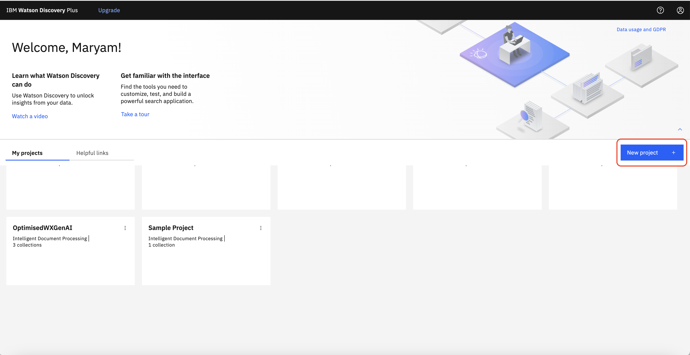

The next window will let you set a project name. Then you can pick a project type from the dropdown list based on the purpose of the project.

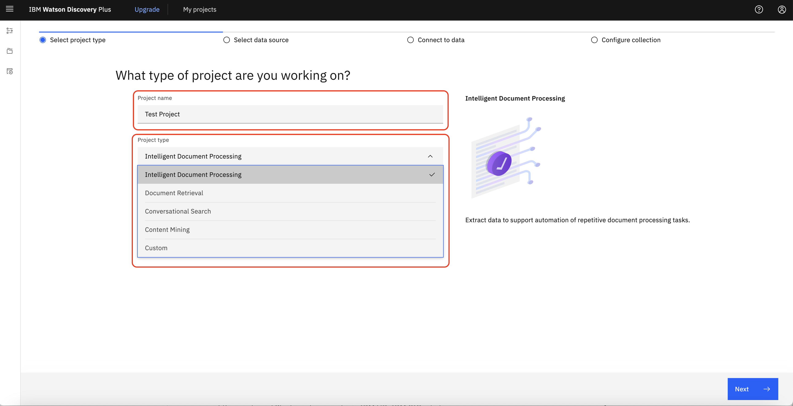

The following table provides a references for selecting a project type based on the need and goal.

**_Project type description:_**

| Project Type                         | Need                                                                                  | Goal                                                                                                                                                                                                           |
| ------------------------------------ | ------------------------------------------------------------------------------------- | -------------------------------------------------------------------------------------------------------------------------------------------------------------------------------------------------------------- |
| **Intelligent Document Processing**  | I want to extract data to support automation of repetitive document processing tasks. | I want to understand quickly what data is extracted from my documents and improve the data by applying enrichments.                                                                                            |
| **Document Retrieval**               | Which document contains the answer to my question?                                    | Find meaningful information in sources that contain a mix of structured and unstructured data, and surface it in a stand-alone enterprise search application or in the search field of a business application. |
| **Document Retrieval for Contracts** | Where is the part of the contract that I need for my task?                            | Quickly extract critical information from contracts.                                                                                                                                                           |
| **Conversational Search**            | I want the chatbot I'm building to use knowledge that I own.                          | Give a virtual assistant quick access to technical information that is stored in various external data sources and document formats to answer customer questions.                                              |
| **Content Mining**                   | I want to uncover insights I didn't know to ask about.                                | Gain insights from pattern analysis or perform root cause analysis.                                                                                                                                            |

### **Step 5: Create a Collection**

- Create the data collection by clicking on the **Create a collection**.
- Provide a name and description for your collection.
- You can add collections of data (documents) from different sources. Choose the data source type (e.g., documents, web pages, databases) and upload your data.

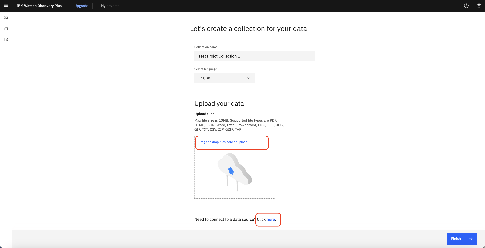

- You can either upload Documents Manually by dragging and droping your documents into the collection or click to upload.

- If you have other data sources to collect the data from, you can click on the **here** and a new window will open and you can select the data source and follow the steps.

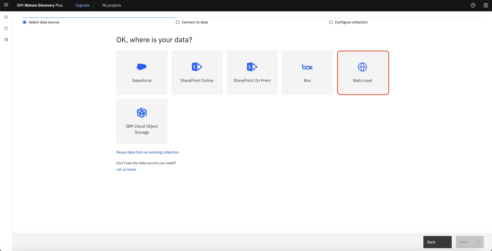

For examples, let's take a look at the web crawl option. Select "Web Crawl" as Data Source and click "next".

### **Step 6: Configure Web Crawl Settings**

- **Set Crawl Schedule**: Configure the frequency of the crawl (e.g., daily, weekly). Regular crawling ensures that your collection stays updated with the latest information from the specified website.

- **Enter Starting URL**: Input the starting URL for the web crawl. This is the initial page from which the crawler will begin extracting data.

- **Include/Exclude Patterns**: Specify URL patterns to include or exclude certain pages. This helps refine the scope of the crawl to ensure relevant data is collected.

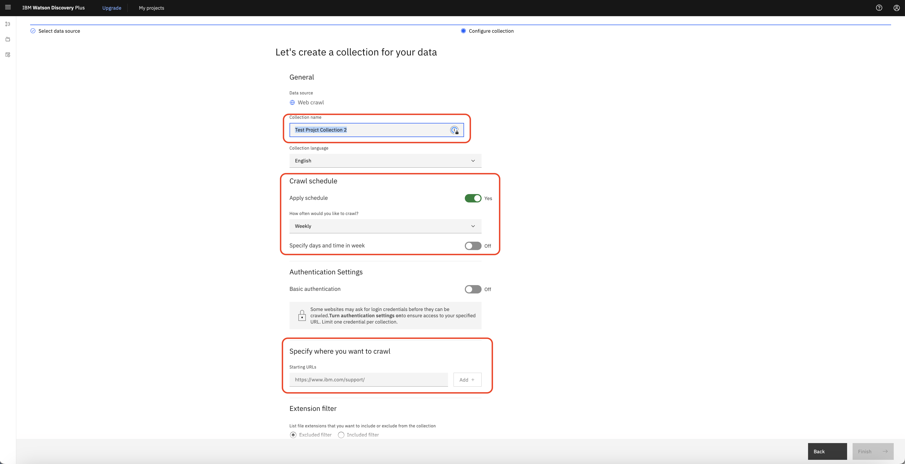

- **Set Crawl Depth**: Define the crawl depth to control how many levels deep the crawler should go from the starting URL. A higher crawl depth allows the crawler to follow more links and extract more data but may take longer and collect more information than needed.

- **Enable the javascript excution**: JavaScript execution can be utilized to process and analyze dynamic web content during data ingestion, allowing for the extraction of valuable information from complex, interactive web pages.

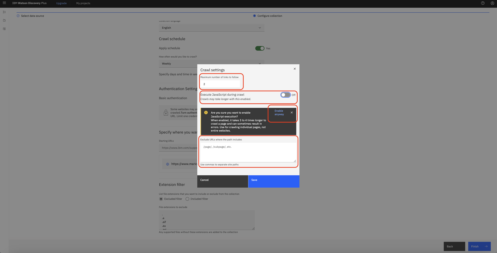

- **Activate OCR**: If you need to extract text out of images, you can activate the OCR option.

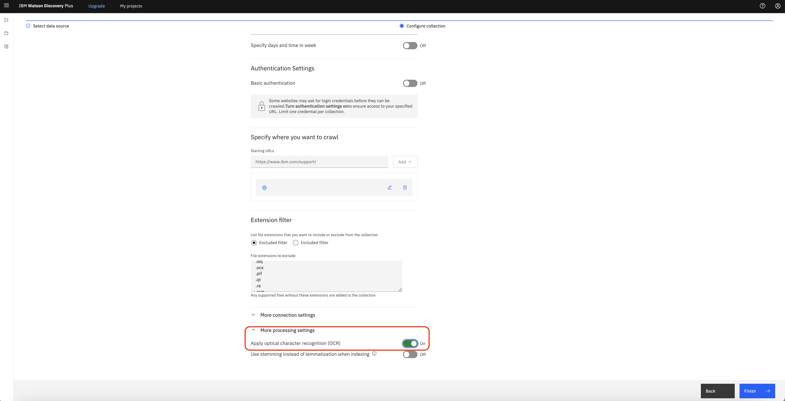

- After configuring the settings, click on "Finish" and the web crawl will start. Watson Discovery will begin to collect data from the specified web pages according to the defined parameters.

- Monitoring and Managing the Crawl: Check the status of your web crawl in the Watson Discovery dashboard. You can see the progress and any errors that might have occurred. If there is any errors or warnings, you can see them in the "Warnings and errors at a glance" section.

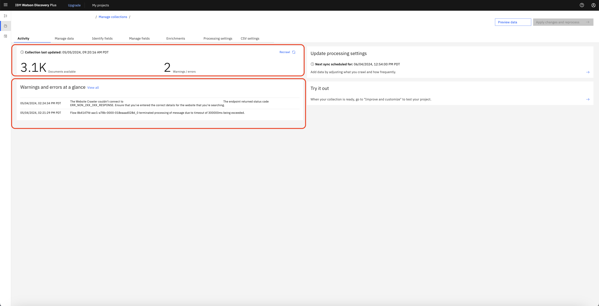

- Manage Crawled Data: Once the crawl is complete, you can view the collected documents in your collection. You can further enrich, query, and analyze this data using Watson Discovery’s powerful tools.

### **Step 7: Document Enrichments to data**

Click the Enrichments tab. The Enrichments page shows you a list of available enrichments. Enrichments make meaningful information easier to find and return in searches. You can apply built-in enrichments to your collection to leverage powerful Natural Language Understanding models that tag terms, such as commonly known keywords.

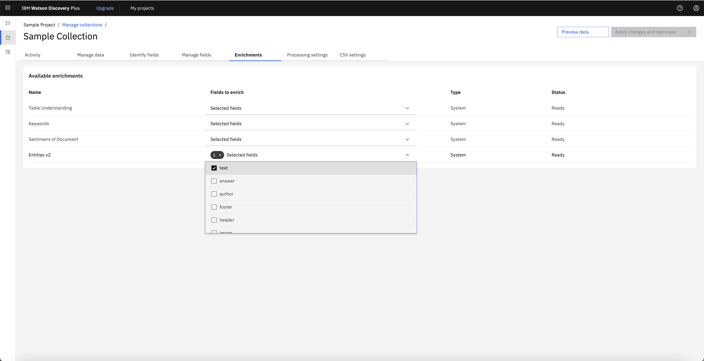

- The **Entities enrichment** is applied to the collection. Entities section, Recognizes proper nouns such as people, cities, and organizations that are mentioned in the content. This enrichment is applied automatically to collections that are added to projects of the Document Retrieval type.

- For the **Entities v2** enrichment, click 1x Selected fields. A list of available fields is displayed and the text field is selected. This selection means that the Entities enrichment was applied to content that was indexed and added to a field named text when documents from the collection were processed.

- From this page, you can apply new enrichments to your collection or change the fields where an enrichment is applied. A powerful feature of Discovery is that you can add your own custom enrichments, such as **dictionaries, patterns, and machine learning models**. When you create custom enrichments, they are listed on this page also. You can manage where they are used from here.
- You are going to apply another enrichment to the collection. Find the Keywords enrichment in the list, and then click **Select fields**. The Keywords enrichment recognizes significant commonly-known terms in your content. Scroll through the list of fields until you find the text field, and select it.
- Click **Apply changes** and **reprocess**. While your documents are being reprocessed to look for and tag keywords, you can continue to explore the tools available for managing a collection.

### **Step 8: Manage data**

In the manage data section, you can view the data and search for a document. Also by clicking on the **change view icon**, you can customize the view of the table into whatever you like the most.

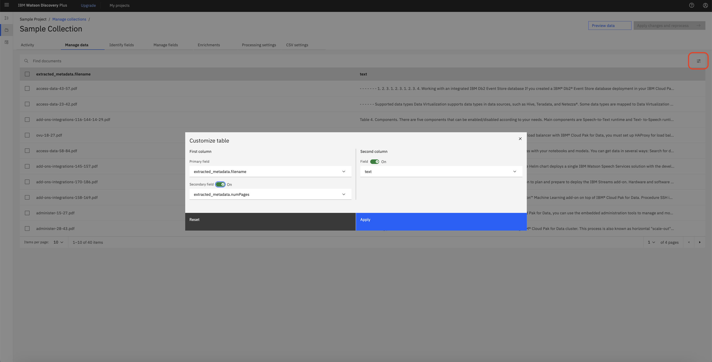

### **Step 9: Identify field**

Most content from a document is indexed in the text field automatically. You might want to index certain types of content in different fields or split up large documents so that the text field contains fewer passages per document. To do so, you can teach Discovery to recognize important fields in your documents by applying a Smart Document Understanding model to your collection.

Smart Document Understanding (SDU) is a technology that learns about the content of a document based on the document's structure. You can apply a prebuilt SDU model or create a custom SDU model.

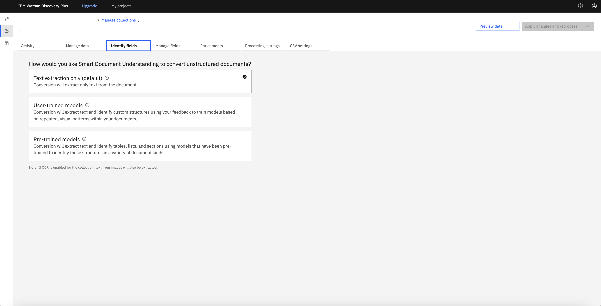

To create a custom SDU model, you select the **User-trained model** option, and then annotate fields in your document and submit the page. Then the model learns from the provided examples and follows the pattern for the rest of the documents.

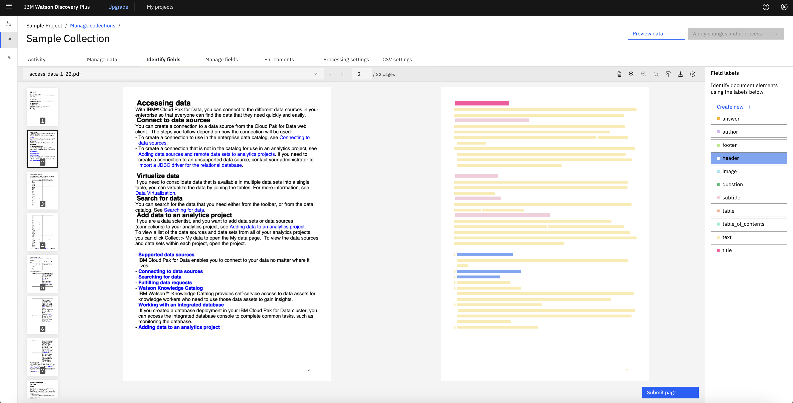

### **Step 10: Manage fields**

The Manage fields page lists the indexed fields. From here, you can include or remove fields from the index. You can also split large documents into many smaller documents.

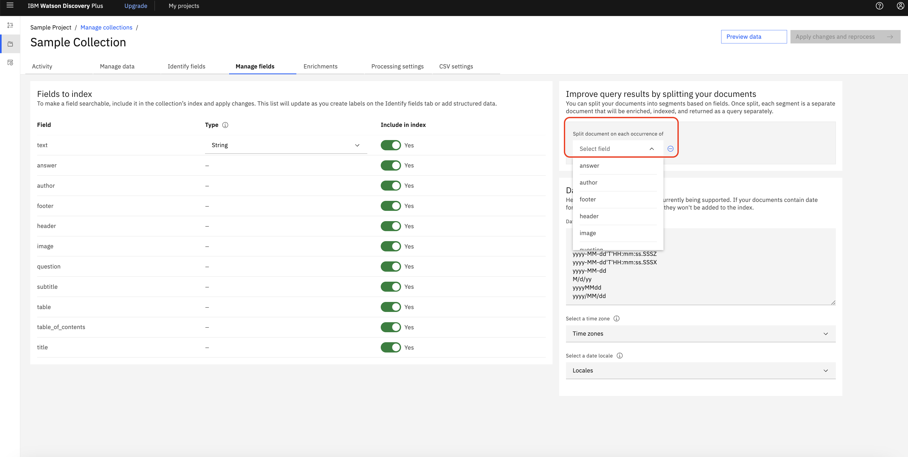

### **Step 11: Search the project**

Click the **Improve and customize icon** from the navigation panel. The Improve and customize page is where you can try out queries, then add and test customizations to improve the query results for your project. A list of sample queries is displayed to help you get started with submitting test queries.

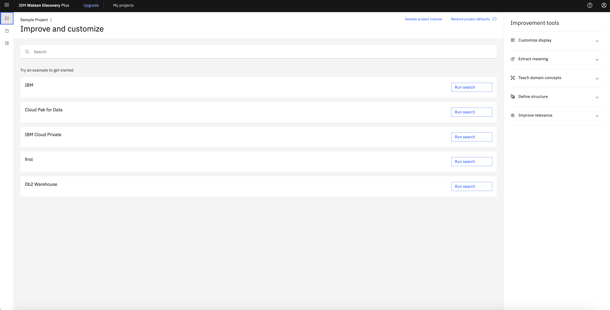

Click the **Run search** button. Query results are displayed. From one of the query results, click **View passages** in document. A preview of the document where the result was found is shown. Do one of the following things to explore the search result.

Click **Open advanced view**. Useful summary information is displayed, such as the number of occurrences of any enrichments that are detected in the document. Select the URL entity to highlight mentions of URLs within the text.

To see how the information from the document is stored in JSON format, click the **View as menu** from the view header, and select JSON. A JSON representation of the document is displayed.

You can explore the JSON representation to see information that Discovery captured from the document. For example, if you expand the enriched_text section, and then expand the entities section, you can see mentions of entities that were recognized and tagged by the Entities enrichment.

### **Step 12: Share the project**

Click **Integrate and deploy** from the navigation panel. From here, you can share your project with colleagues and deploy it. Follow the on-screen instructions to add a user, and then send login credentials and the provided link to your colleague.

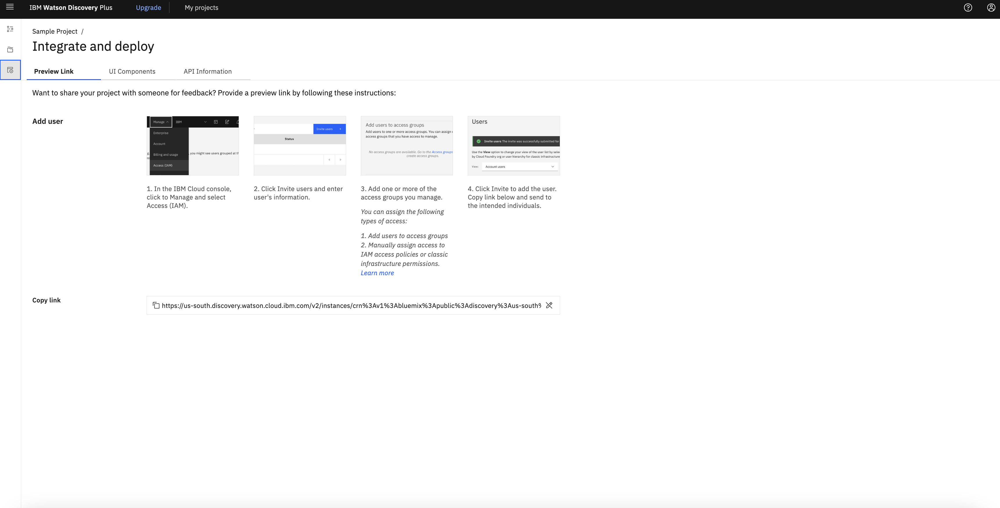

After you build your own search application and are ready to deploy it, you can use prebuilt user interface components or build a custom application.

Click **API Information**. From this page, you can get the **project ID** for your project. You need the project ID to use the Discovery API. You also need the **service instance URL** and **API key**. The credential details are available from the Manage page of your service instance in IBM Cloud.
Click **UI Components** to find links to ready-to-use code that you can use to create a full-featured search application faster.
