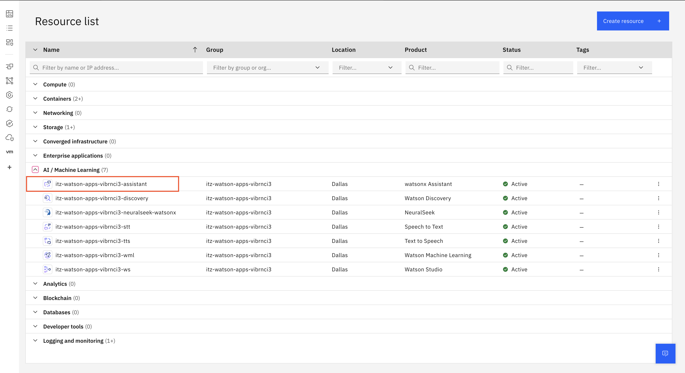

# Accessing watsonx Assistant via API


## Overview

This page will demonstrate how to access watsonx Assistant via an API call.

### Resources
  - [watsonx Assistant v2](https://cloud.ibm.com/apidocs/assistant-v2)


## Steps:

1. Access watsonx Assistant from Resource List in the IBM Cloud Account


   
2. Get API Key for watsonx Assistant from Launch webpage


3. Get Serice Instance URL from Launch webpage


4. Get Assistant ID from webpage within the Assistant settings
  - Head to the Homepage of your assistant:
    
  - Access the Assistant Settings on the bottom left corner of the page:
    
  - Select *View details* on the Assistant IDs and API details section of the page:
    
  - Get the required information from this pop-up window:
      

5. Copy the Skill ID from the watsonx Assistant settings

6. Obtain the Session ID from CLI CURL

```{}
curl -X POST -u "apikey:{apikey}" "{url}/v2/assistants/{environment_id}/sessions?version=2021-11-27" 
```
7. Get all parameters from CLI CURL

```{}
curl -X GET -u "apikey:{apikey}" "{url}/v2/assistants/{assistant_id}/skills/{skill_id}?version=2021-11-27"
```

8. Run Query from CLI CURL as API call to watsonx Agent

```{}
curl -X POST -u "apikey:{apikey}" --header "Content-Type:application/json" --data "{\"input\": {\"text\":
\"Hello\"}}" "{url}/v2/assistants/{environment_id}/sessions/{session_id}/message?version=2024-08-25"
```
