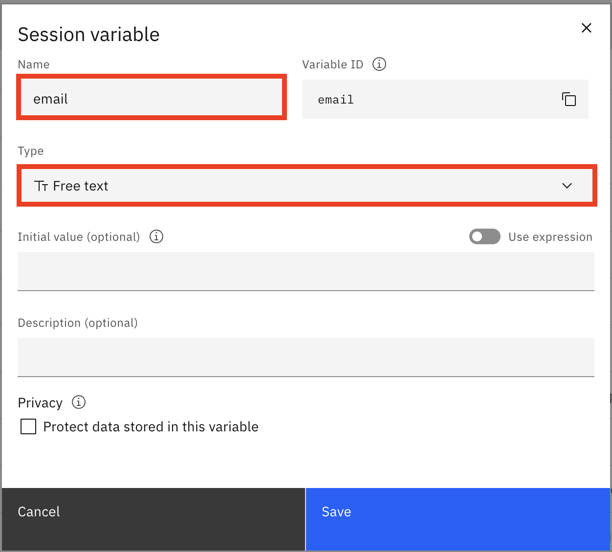

# Connecting watsonx Assistant to External Database

## Integrating with data source services on Microsoft Azure

Please refer to the following [link](https://www.ibm.com/docs/en/watsonx/saas?topic=platforms-integrating-data-source-services-azure){ target=\_blank}.

## Integrating with Db2 Database (example)

### Retrieve Database Service Credentials

First, you will need to retrieve service credentials from your Db2 instance. Go to your Db2 instance, select the **Service credentials** page, and click on the **New credential** button in the top right.


Name your credentials as you like, select **Manager** as the role, and click **Add**.


!!! note "Credentials to Note"

    You will need some of the credentials that you've just created later on in the article. Open up the service credentials and note the **database**, **hostname**, **port**, **username**, and **password**.

### Create Table in Db2

Navigate to the **Manage** section from the menu on the left and click on the **Go to UI** button.


Click on the **SQL** tab and paste the SQL statement from below. Click **Run all**.


```mysql linenums="1"
CREATE TABLE USER_INFO (
  NAME VARCHAR(255),
  EMAIL VARCHAR(255),
  ADDRESS VARCHAR(255)
);
```

!!! note "Table Info"

    This statement creates a table called **USER_INFO** with 3 columns: **NAME**, **EMAIL**, and **ADDRESS**.

Next, navigate to the **Data** tab from the left hand menu. From there, select **Tables** from the menu on top and select the available schema. You should see the **USER_INFO** table and when you click on that you should see the table definition with the columns listed as well. Once we send data to the database, you will be able to view the data by coming back to this page and clicking the **View data** button.


### Host a Public Endpoint for Code Snippet

We will need code for the actual action to send our data to the database and an endpoint for our watsonx Assistant to hit. Use a tool that hosts your code and exposes a public endpoint. You can use the code from below. Make sure to update your database credentials on lines 7-11 and the schema on line 28.

```py linenums="1"
import sys
import json
import os, ibm_db, ibm_db_dbi
import pandas as pd
import requests
def main(params):
    dsn_database = "xxxxxxx"            # e.g. "MORTGAGE"
    dsn_uid      = "xxxxxxx"            # e.g. "dash104434"
    dsn_pwd      = "xxxxxxx"            # e.g. "7dBZ3jWt9xN6$o0JiX!m"
    dsn_hostname = "xxxxxxx"            # e.g. "Use the same IP as Web Console"
    dsn_port     = "xxxxxxx"               # e.g. "50000"
    dsn_protocol = "TCPIP"               # i.e. "TCPIP"
    dsn_driver   = "IBM DB2 ODBC DRIVER" # Don't change
    dsn = ("DRIVER={{IBM DB2 ODBC DRIVER}};" "DATABASE={0};" "HOSTNAME={1};" "PORT={2};" "PROTOCOL=TCPIP;" "UID={3};" "PWD={4};SECURITY=SSL").format(dsn_database, dsn_hostname, dsn_port, dsn_uid, dsn_pwd)

    options = { ibm_db.SQL_ATTR_AUTOCOMMIT:  ibm_db.SQL_AUTOCOMMIT_ON }
    connection = ibm_db_dbi.connect(dsn, dsn_uid, dsn_pwd, dsn_hostname, dsn_database, options)
    cursor = connection.cursor()

    columns = ['NAME','EMAIL','ADDRESS']

    # The value you want to insert
    name = params['name']
    email = params['email']
    address = params['address']
    columns_str = ', '.join(columns)
    placeholders = ', '.join(['?'] * len(columns))
    insertSQL = f'INSERT INTO XXXXXX.USER_INFO ({columns_str}) VALUES ({placeholders});'

    # Executing the SQL query with the value to insert
    cursor.execute(insertSQL, (name, email, address))
    # Committing the transaction

    connection.commit()
    # Closing the cursor and connection

    cursor.close()
```

This action takes 3 parameters - name, email, and address - and sends them to the database.

Once you've saved this code snippet and found the public endpoint, take note of the endpoint as we will need this for later.

### Create OpenAPI Document

An OpenAPI document describes an API in terms of paths and operations. In OpenAPI terms, paths are endpoints (resources), such as a hotel reservation or a customer record, that your API exposes, and operations are the HTTP methods used to manipulate these paths, such as GET, POST, or DELETE.

You can use the [Swagger Editor](https://editor.swagger.io/){ target=\_blank} to create and modify your OpenAPI document.

You can use the following block of sample OpenAPI document in your Swagger Editor. I have provided it in a .json format since watsonx Assistant requires an OpenAPI document in .json format to build a custom integration.

Make sure to update the url (line 10) and the path (line 15) to match the endpoint you noted from the previous step.

```json linenums="1"
{
  "openapi": "3.0.3",
  "info": {
    "title": "Swagger Db2 WA Extensions",
    "description": "This is a Swagger Connecting WA to a Db2 using Cloud Function",
    "version": "1.0.0"
  },
  "servers": [
    {
      "url": "https://xxxxxxxx",
      "description": "Dallas, USA"
    }
  ],
  "paths": {
    "/xxxxx/xxxxx/xxxxx.json": {
      "post": {
        "parameters": [],
        "summary": "Send user info",
        "description": "Send info from user to db2 database",
        "operationId": "sendUserInfo",
        "requestBody": {
          "description": "Payload to send user info to db2 database.",
          "content": {
            "application/json": {
              "schema": {
                "type": "object",
                "properties": {
                  "name": {
                    "type": "string",
                    "description": "user name"
                  },
                  "email": {
                    "type": "string",
                    "description": "user email"
                  },
                  "address": {
                    "type": "string",
                    "description": "user address"
                  }
                }
              }
            }
          },
          "required": true
        },
        "responses": {
          "200": {
            "description": "Successful operation.",
            "content": {
              "application/json": {
                "schema": {
                  "type": "object",
                  "properties": {
                    "user_info": {
                      "type": "string"
                    }
                  }
                }
              }
            }
          },
          "405": {
            "description": "Invalid input."
          }
        }
      }
    }
  }
}
```

!!! note "Request Body Properties"

    For the requestBody section (starting on line 21), you can see that there are 3 “properties” defined here

    - name: a string (line 28)
    - email: a string (line 32)
    - address: a string (line 36)

    They are required parameters that the user will input when they interact with watsonx Assistant.

### Integrating Custom Extenstion in watsonx Assistant

Go to your watsonx Assistant instance. Navigate to the **Integrations** tab from the menu on the left-hand side of the page.


From the integrations page, scroll down to the **Extensions** section and click on the **Build custom extension** button.


On the **Get started** screen, click the **Next** button in the top right corner of the screen to get to the **Basic information** section. Name your extension, give it a description, and click **Next**.


On the next page, upload the OpenAPI file you created from the previous steps.


Click **Finish** in the top right corner.

You will see that the extension you just built is now under the **Extensions** section. Click on **Add** on the bottom right corner of the tile. On the next pop-up screen, click the **Add** button.


On the Get started screen, click on **Next** in the top right corner to get to the next screen. Make sure your server is correct, and click on **Next**.


On the “Review operations” screen, click on “Finish” to have the extension added to your Assistant.


### Create Action in watsonx Assistant

Now that we've created the extension, let's go and create the action that will use this extension to send the user info variables from watsonx Assistant to the database.


First, we'll want to create the variables that we need to send over to store in the database: name, email, and address.

To create variables, we'll need to go to **Created by you** under **Variables**.


Click on **New variable** in the top right corner to create our first variable.

Fill in the **Name** and select the **Type** as well for our _name_ variable that is going to be accepted as _Free text_. Click **Save** to create the variable.


Now, repeat this step 2 times but for the other variables that we need: email and address.




Now, navigate back to the action page.


Click on **New action** in the top right corner to create our action. Select **Start from scratch** for how we want to build our action.

In the following pop up box, regarding how to start the interaction, we can enter "user info" as the input the user would type to begin this interaction. This prompt to start the interaction can be changed later on as well. Click **Save**.


Click on Step 1, in this step we would ask the user what the user's name is under **Assistant says**. Names should be accepted as free text (string), so click on **Define customer response** and select **Free text** from the list.


Use the blue **New step** button to create the second step. Before the Assistant does anything in the second step, we should make sure it collects the user’s response for what the user's name is from the previous step. Click on **Set variable values** in the top right corner, **Set new value**, and click on **Session variables**.


Under **Session variables**, choose **_name_** from the list, and in the **To** field, click on **Action variables** and select the question you asked the user in the first step.


Now that we have saved the user’s name as a variable, we also want to know what their email is. Under **Assistant says**, ask them what their email is. Under **Define customer response**, select **Free text** (similar to what you did in step 1).


Use the blue **New step** button to create the third step. Similar to the second step, we should make sure it collects the user’s response for what the user's email is from the previous step. Click on **Set variable values** in the top right corner, **Set new value**, and click on **Session variables**. Set **_name_** to the **Action variable** from the question you asked the user in the second step.


Repeat the same steps for the third and final variable: address.


Now, we'll create a new step to send our set variables to be stored into the database. So, create a new step as you did before. Under **And then**, select "Continue to next step" and change it to "Use an extension".


In the following pop up, select the following options. Under **Extension**, select the custom extension we created "user-info-extension". Under **Operation**, select the one operation we listed in the OpenAPI file "Send user info". And then, under **Optional parameters**, set each parameter to the variables we just in the previous steps (name, email, and address). Click **Apply**.


Great! Now, we have the extension set up to send the acquired data to our database.

If you want, you can test the extension by clicking the **Preview** button in the bottom right corner. Make sure to use the phrase we set to prompt this action to begin (we set the prompt as "user info" but you can change it to whatever you want).
