# Uploading Video Response in watsonx Assistant


## Overview

This page will demonstrate how to upload a video to Cloud Object Storage (COS), generate a URL for the uploaded video, as well as how to use it within a RAG scenario in the watsonx Assistant UI.

### Resources
  - [Cloud Object Storage](https://www.ibm.com/products/cloud-object-storage?utm_content=SRCWW&p1=Search&p4=43700080002805342&p5=e&p9=58700008705498680&gclid=CjwKCAjw0aS3BhA3EiwAKaD2ZS65E_idgijcpWF9uDbPmvpjDAu0_gK94u5l6ALfAAs5D4F7YKJ2tBoCmVsQAvD_BwE&gclsrc=aw.ds)
  - [Cloud Object Storage Documentation](https://cloud.ibm.com/docs/cloud-object-storage?topic=cloud-object-storage-getting-started-cloud-object-storage)


## High level steps:

1. Get access to COS
      - The Seller or CSM associated with your account should be able to direct you in how to obtain access

2. Uploaded video to Cloud Object Storage

3. Generate a pre-signed URL

4. Place generated URL within Knowledgebase Document
      - This step will vary based on what type of document you are uploading. For this walkthrough we will be using a Microsoft PowerPoint document
      - Please see the **[Watson Discovery](../watson-discovery/WatsonDiscovery.md)** documentation section for instructions on uploading those files 

5. Update the Return parameter in the search extension within watsonx Assistnat
      - Please see the **[Integrations](../integrations/integrations.md)** documentation section for instructions on integrating watsonx Assistant with the knowledgebase
  
6. Create a Session Variable for the URL
      - Please see the **[watsonx Assistant](../watsonx-assistant/index.md)** walkthrough for more information on creating session variables
  
7. Create an iframe embedding with the Session Variable as Source

## COS Walthrough

### **Step 1: Cloud Object Storage Instance**

Once you have obtained your Cloud Object Storage Instance, you may access the instance through the Resource List in your IBM Cloud Account. 
Please select on the instance as shown in the screen capture below:

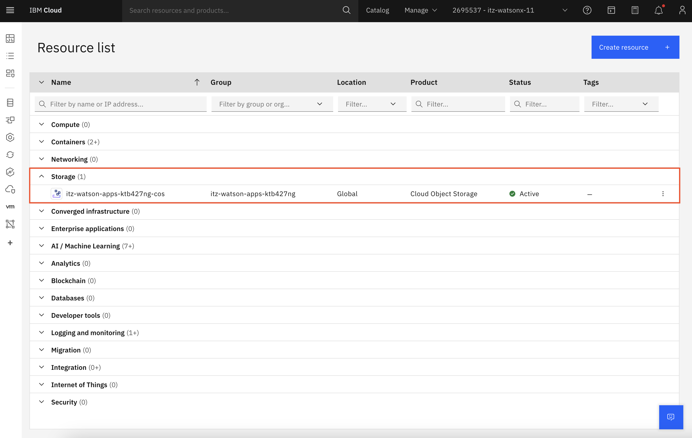

### **Step 2: Create Bucket**

Once you have selected the instance, you must create a bucket. Please select the *Create Bucket +* button.

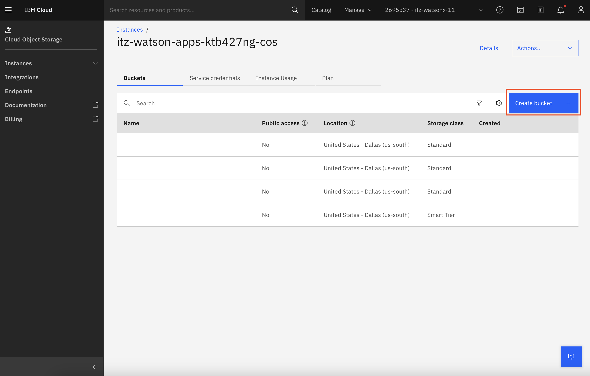

### **Step 3: Custom Bucket**

This step may vary based on what the Seller or CSM tied to your account tells you. For this walkthrough example we will be going with a Custom Bucket. Please select the *Create a Custom Bucket* option.

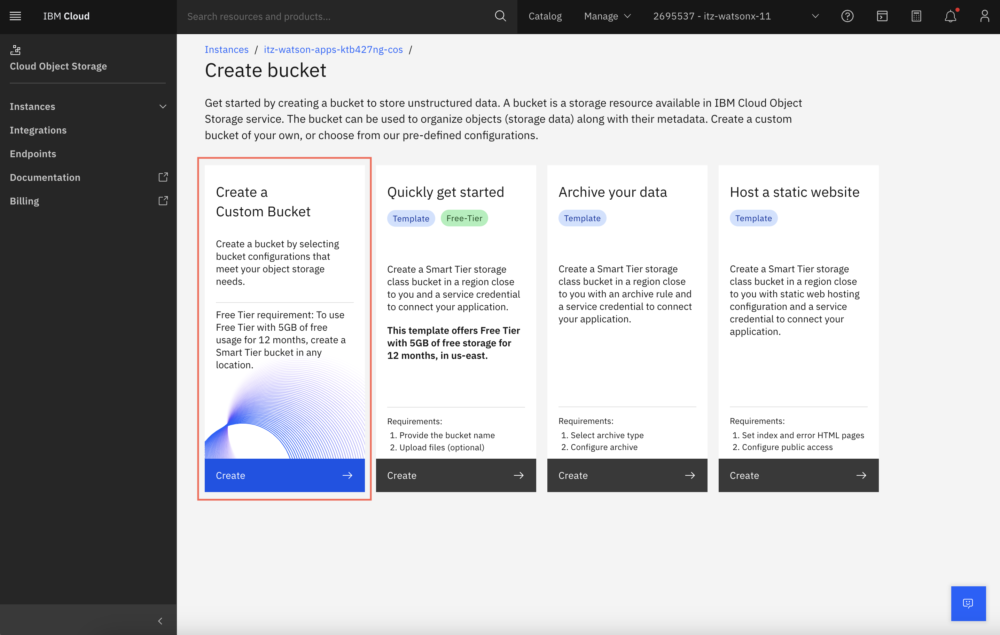

### **Step 4: Name Bucket**

Please add a name to the Cloud Object Storage Bucket within your instance. The specific configuration of your bucket may vary based on what the Seller or CSM tied to your account tells you. For this example we will leave the configurations as default. Please select *Create Bucket* at the botton right of the screen once named.

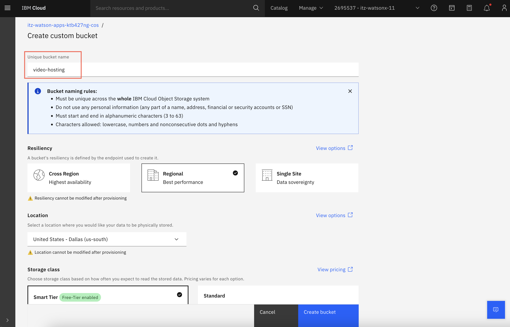

### **Step 5: Selecting Bucket**

Once you have created your bucket you will see it within your instance. Please select the custom bucket that was created in the brevious screen.

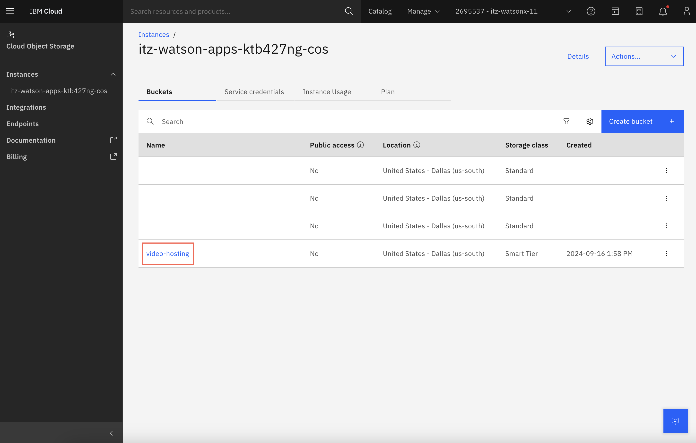

### **Step 6: Upload Files**

In this step, you will upload the files that you want to be stored in COS. Please drag and drop your files to the grey box area. In this walkthrough example we are using a watsonx Video. 

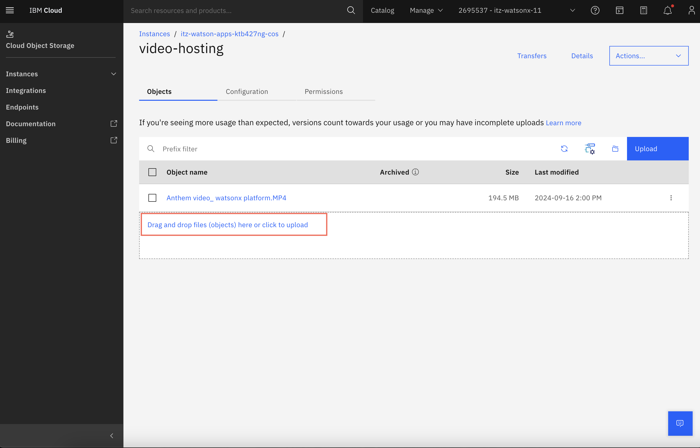

### **Step 7: Endpoints**

#### Endpoint URL

Please select the *Endpoints* on the far left side of the screen. On this page, you will find the endpoint URLs which you will use in a later step of this example walkthrough.

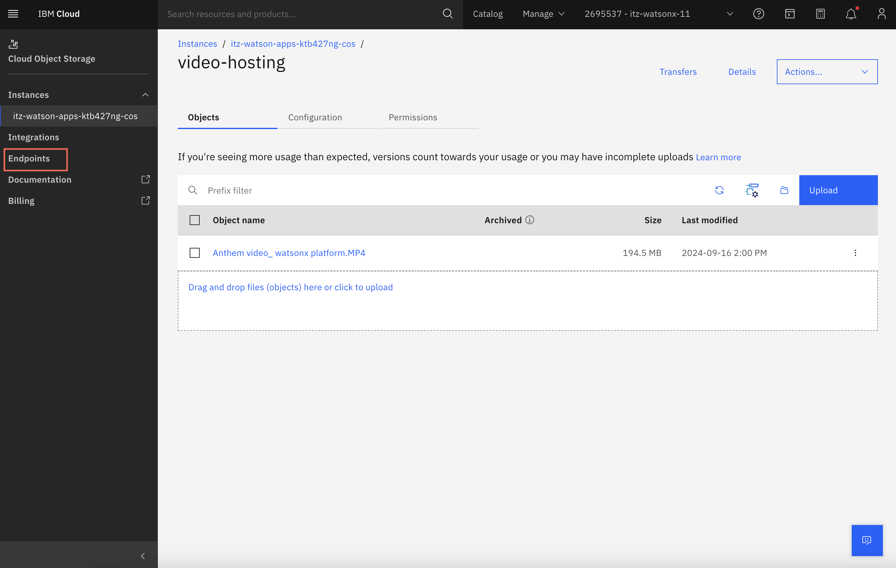

### **Step 8: API Key**

Please scroll down to the bottom of the endpoint page and select the *Get Credentials* button on the *Get and API Key* option.

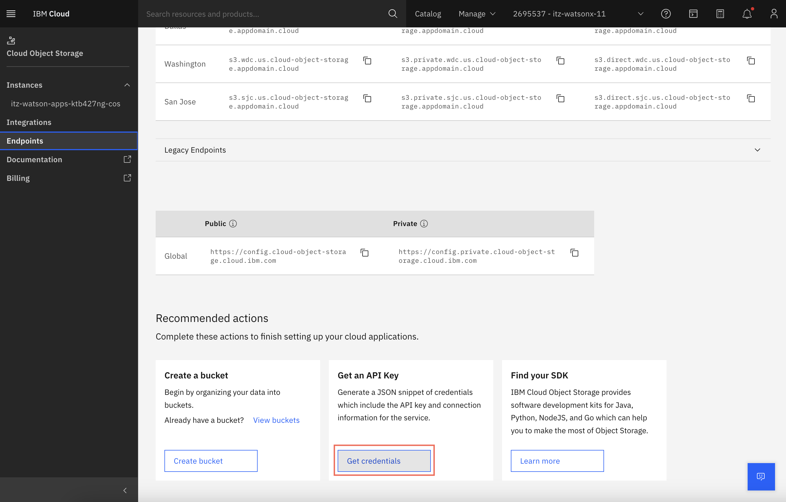

### **Step 9: Service Credentials**

Once you have entered the credential page, you should select *New Credential* in order to obtain keys that are vital for steps below.

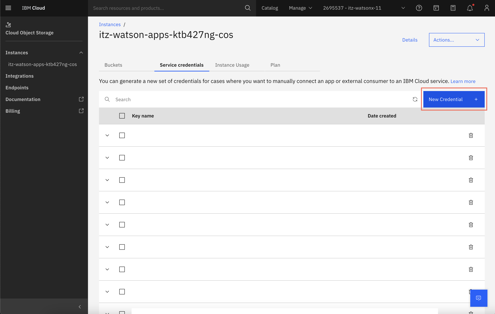

### **Step 10: HMAC Credentials**

When creating the Service Credentials, it is important to **Include HMAC Credentials** as these are the important keys needed for generating the URL. Select *Add* once the toggle for HMAC credentials is selected.

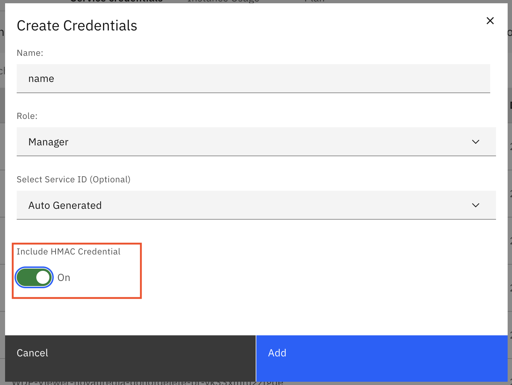

### **Step 11: Obtaining Keys**

Once created, you will be able to see the credential in the **Service Credential** page and use the drop down to see the full creadentials.

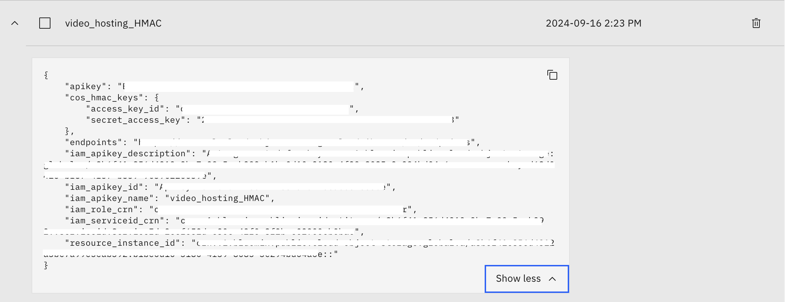

## URL Walkthrough

### **Step 12: Generating Pre-Signed URL**

#### **Locate Documentation**

From this step you will be able to locate code that will allow you to generate a URL from the specified item in your COS bucket.

##### Resource
   - [Generating a pre-signed URL](https://cloud.ibm.com/docs/cloud-object-storage?topic=cloud-object-storage-presign-url)

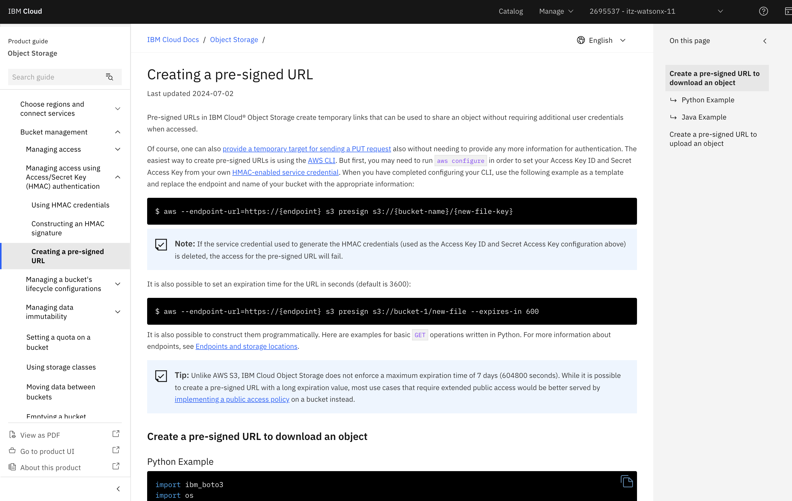

#### **Copy Code**

From the above site, you will have several options of creating a URL, in this example walkthrough we will be using python.

```{python}
import ibm_boto3
import os

bucket_name = '<bucekt name>'
key_name = '<object key name>'
http_method = 'get_object'
expiration = 600  # time in seconds, default:600

access_key = '<COS_HMAC_ACCESS_KEY_ID>'
secret_key = '<COS_HMAC_SECRET_ACCESS_KEY>'
# Current list avaiable at https://control.cloud-object-storage.cloud.ibm.com/v2/endpoints
cos_service_endpoint = 'https://s3.<region>.cloud-object-storage.appdomain.cloud'

cos = ibm_boto3.client("s3",
                       aws_access_key_id=access_key,
                       aws_secret_access_key=secret_key,
                       endpoint_url=cos_service_endpoint
                       )

signedUrl = cos.generate_presigned_url(http_method, Params={
                                       'Bucket': bucket_name, 'Key': key_name}, ExpiresIn=expiration)
print("presigned download URL =>" + signedUrl)

```

Copy this code and save it in a python file to run. 

Utilize the Service Credentials and Endpoint URL created/located in previous steps to fill in the specified variables. Please notes that key_name refers to the item that you wish to generate a URL for. The expiration date can be bypassed by utilizing a public bucket. More information within the documentation referenced above.

Run the python file. The output will be a URL. 

*Output example: https://s3.us-south.cloud-object-storage.appdomain.cloud/BUCKETNAME/KEYNAME?AWSAccessKeyId=ACCESSKEYID* (link is expired)

## Metadata Walkthrough

### **Step 13: Locate Document File Properties**

Please open the document you wish to associate generated URL with. Once this is done select File in the corner. As specified in an earlier section, the file type may be different based on what you are doing within your organization. This example uses a Microsoft PowerPoint document. 


### **Step 14: Paste into Properties**

Please open the properties of the desired file from the *File* section of the toolbar.

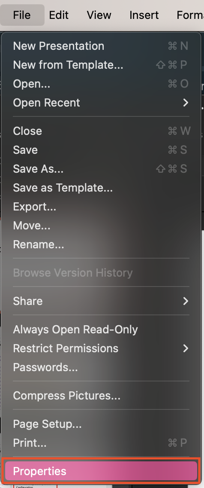

Paste the Generated URL in the subject of the properties panel for the document you wish to associate the generated URL with. 

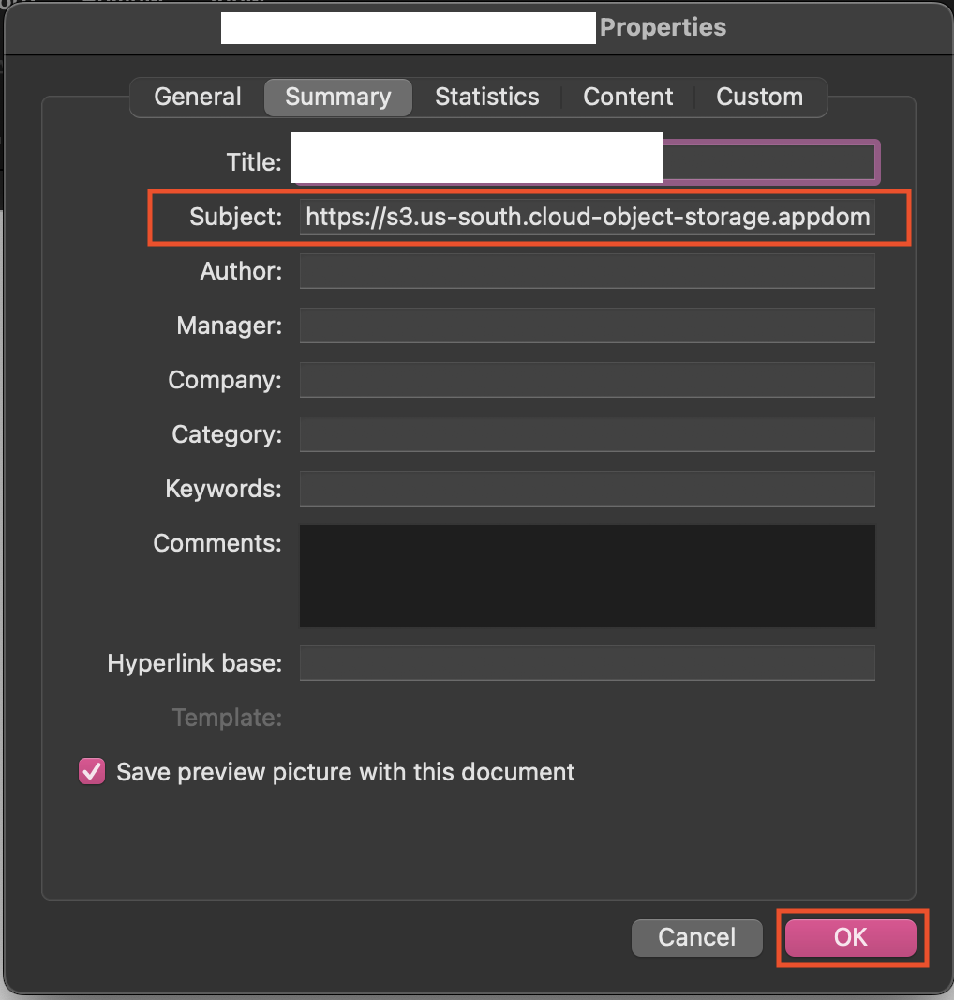

Once this step is complete you can upload this document to your knowledgebase. For instructions on that please refer to the **[Watson Discovery](./watson-discovery/WatsonDiscovery.md)** section of this documentation.

## Utilizing URL Walkthrough

### **Step 15: Return Alteration**

Within your search extension configuration in watsonx Assistant, please update the Return Parameter to include the extracted_metadata variable. This will allow for a session variable to pick up the URL which was pasted in the metadata of the document.

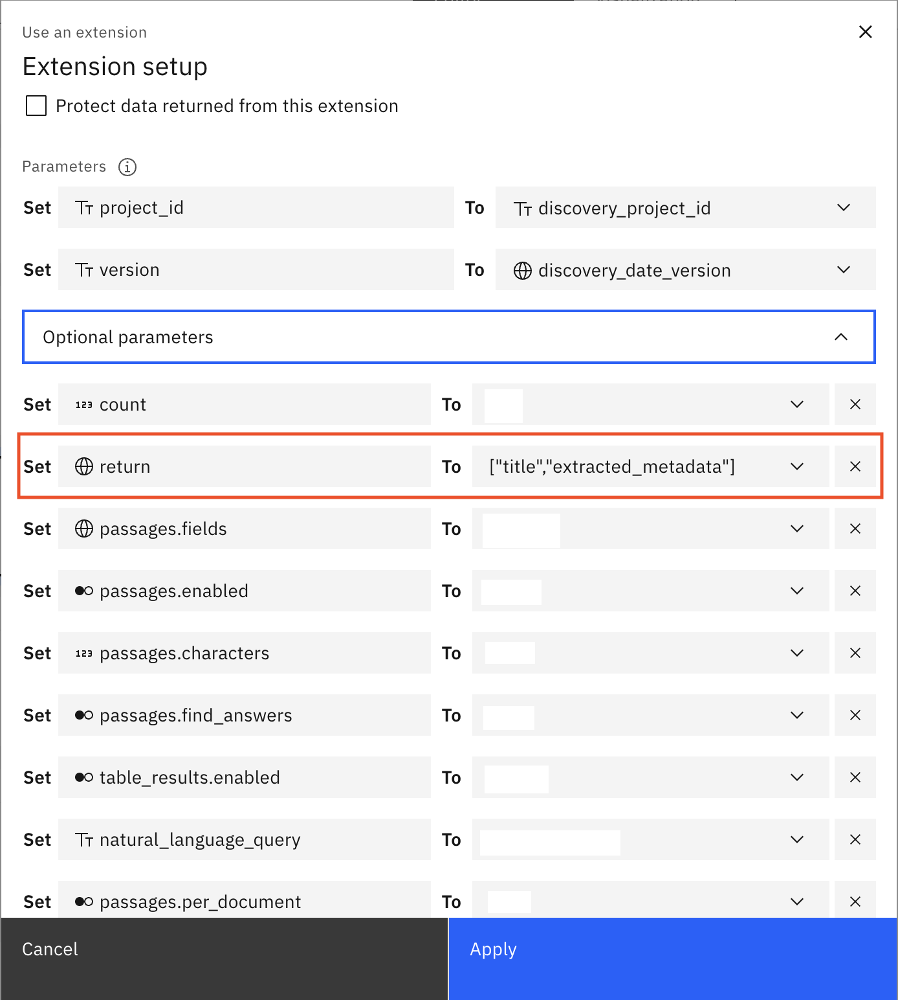

### **Step 16: Session Variable Asignment**

Please create a session variable for this URL. In this example the variable is called *'video_url'*. For information on creating a session variable please see the watsonx Assistant section of this documentation. 

Assign the extracted_metadata subject to that session variable as shown below:

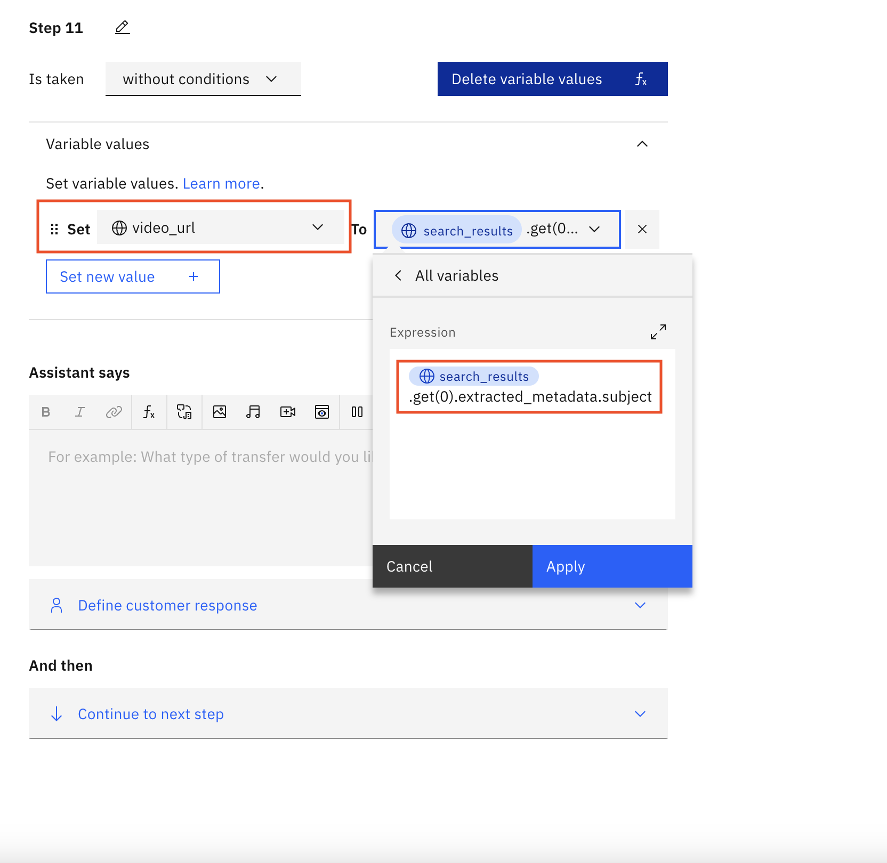

The Expression code is shown below. This code may change based on where the URL was put within the metadata and how the document was uploaded to the database.

```
${search_results}.get(0).extracted_metadata.subject
```

This assigns the generated URL to the created *'video_url'* session variable.

### **Step 17: Display URL**

In whichever way suits your business needs, please utilize the URL with an action in watsonx Assisant.

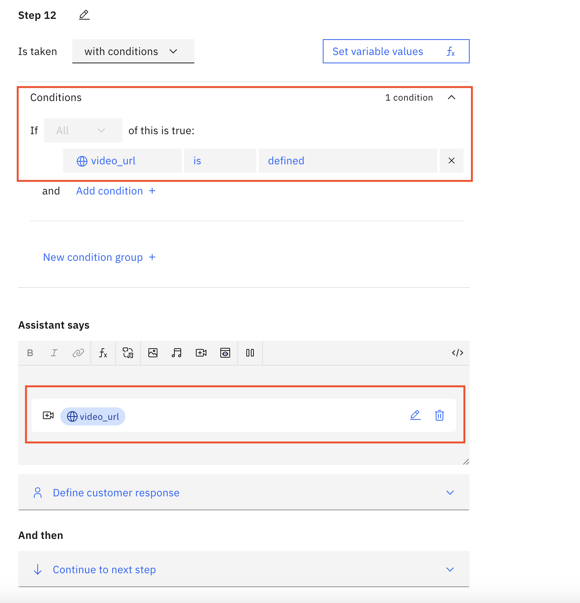

### **Step 18: iframe Embedding**

Ensure that the *'video_url'* session variable is set as the source of the iframe video embedding.

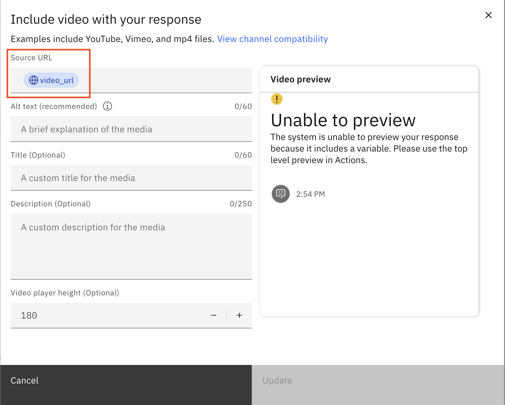

See JSON below:

```{JSON}
{
  "generic": [
    {
      "title": "",
      "source": "${video_url}",
      "alt_text": "",
      "description": "",
      "response_type": "video",
      "channel_options": {
        "chat": {
          "dimensions": {
            "base_height": 180
          }
        }
      }
    }
  ]
}
```

Please note that this example is a walkthrough and not meant to be a fully built out solution. This walkthrough demonstrates one of many ways to accomplish the task of utilizing a URL of an item hosted on IBM COS. 

Some of these tasks can be automated through code.
