# watsonx AI Essentials (Getting started with Generative AI)

## Overview

IBM® watsonx.ai™ AI studio is part of the IBM watsonx™ AI and data platform, bringing together new generative AI (gen AI) capabilities powered by foundation models and traditional machine learning (ML) into a powerful studio spanning the AI lifecycle. Tune and guide models with your enterprise data to meet your needs with easy-to-use tools for building and refining performant prompts. With watsonx.ai, you can build AI applications in a fraction of the time and with a fraction of the data. watsonx.ai offers:

- **Multi-model variety and flexibility:** Choose from IBM-developed, open-source and third-party models, or bring your own model.
- **Differentiated client protection:** IBM stands behind IBM-developed models and indemnifies the client against third-party IP claims.
- **End-to-end AI governance:** Enterprises can scale and accelerate the impact of AI with trusted data across the business, using data wherever it resides.
- **Hybrid, multi-cloud deployments:** IBM provides the flexibility to integrate and deploy your AI workloads into your hybrid-cloud stack of choice.

## Features

- **Foundation Models**: watsonx.ai includes a range of pre-deployed large language models, both IBM proprietary and open-source models from platforms like Hugging Face. These models are designed for a variety of generative AI tasks, and users can select and tune models to fit specific use cases.

- **Prompt Lab**: This tool allows users to quickly experiment with AI tasks using a minimal number of labeled examples. It's part of the studio's user-friendly interface that facilitates rapid prototyping and testing of AI models.

- **Tuning Studio**: Here, users can customize foundation models with their own data. This feature supports efficient, low-cost adaptation of models for specific enterprise needs, utilizing state-of-the-art fine-tuning techniques developed by IBM Research.

- **Synthetic Data Generator**: Recently launched, this tool helps users create artificial tabular data sets. It's designed to assist in generating insights for AI model training, enhancing decision-making processes while minimizing risk.

- **Hybrid Cloud Tools**: watsonx.ai operates on a cloud-native infrastructure optimized for both training and serving foundation models. This flexibility allows for the deployment of models in various environments, including on-premises setups.

These components are integrated into a comprehensive platform that supports the entire lifecycle of AI model development, from initial creation to deployment and management, ensuring enterprises can leverage AI effectively across various business functions.

## watsonx.ai walkthrough

In this document, you will learn how to implement generative AI use cases in watsonx.ai. watsonx.ai is an AI platform that supports both traditional machine learning applications and those leveraging Large Language Models (LLMs) for tasks such as generation, summarization, and classification.

Note: LLMs are a type of foundation model. In IBM tools and documentation, the terms LLM and foundation models are used interchangeably.

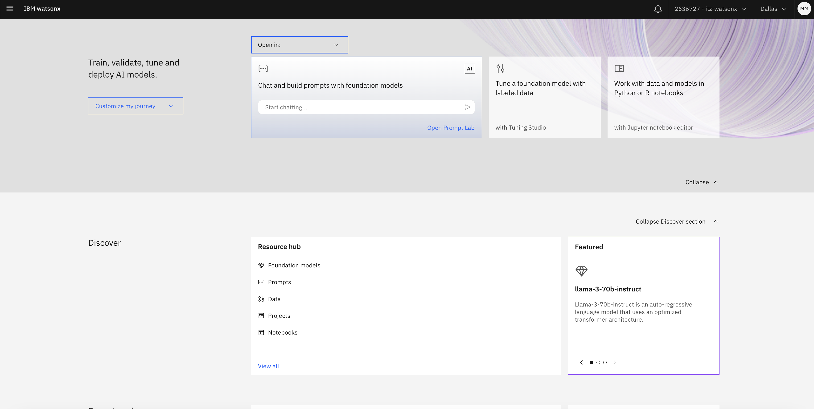

Generative AI is a cutting-edge field in AI, enabling users to interact with models using natural language. A user sends requests (prompts) to a model, and the model generates a response. To an end user, generative AI may resemble a chatbot or a search engine, but its implementation differs significantly from legacy chatbots that rely on hardcoded business rules and search engines that use indexing.

Generative AI uses Large Language Models (LLMs) to generate responses to prompts.

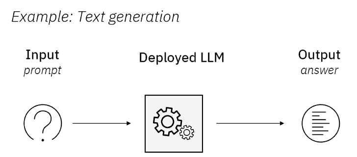

## Prompt Lab in watsonx.ai

We will use the Prompt Lab in watsonx.ai to interact with LLMs included in the platform. Typically, users (prompt engineers or data scientists) have three goals in this phase of the LLM lifecycle:

- Find if LLMs can be used for the proposed use case
- Identify the best model and parameters
- Create prompts for the use case.

### **Step 1: Login and create a project**

1. Log in to your **IBM Cloud account**.
2. From the main menu in the top left corner select **Projects -> View All Projects**.
   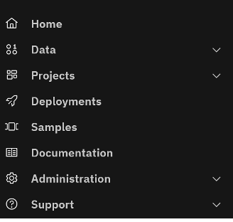
3. Click on the **New Project** button. Select **Empty Project** and choose the project name.
   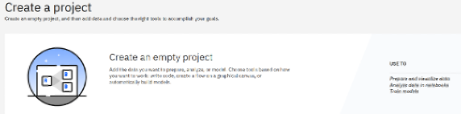
   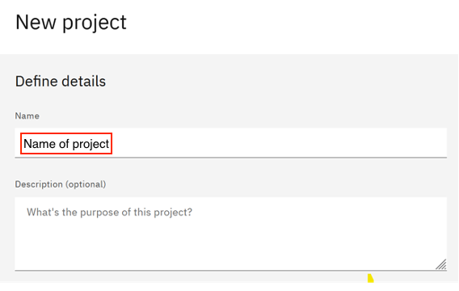

### **Step 2: Associate Services with Project**

1. Switch to the **Services and Integrations** tab, then click **Associate Service**.
   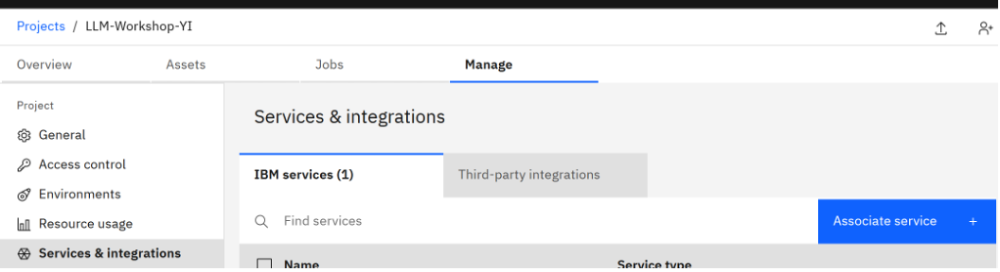

2. Select the displayed **Machine Learning** service and click **Associate**.
   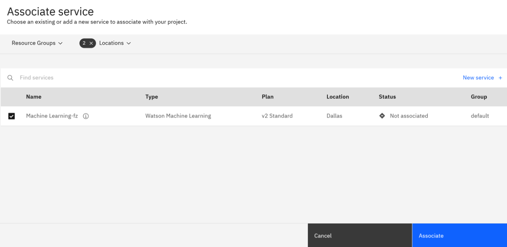

### **Step 3: Create New Assets**

1. Switch to the **Assets** tab, then click the **New asset** button.
   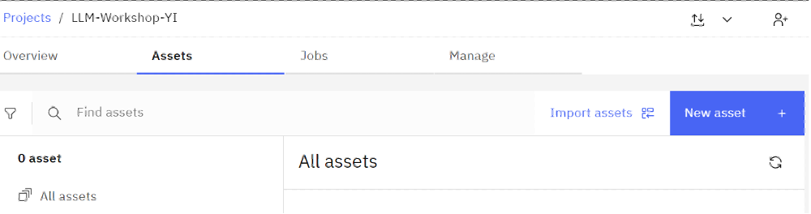

2. Click on the **Experiment with foundation models…** title.
   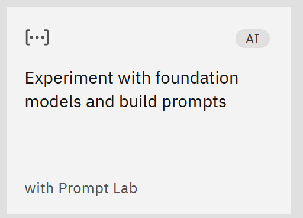

### **Step 4: Prompt Lab**

1. After the Prompt Lab UI opens, to start interacting with the LLM choose from one of the three options availabe:

   - **_Chat_**
   - **_Structured_**
   - **_Freeform_**

2. In the **_Chat_** view, you can chat with the foundational model. You start the chat by submitting a query in the text box as you can see in the image below. Each chat in the conversation builds off the information that was previously exchanged throughout the interaction. Before starting a chat session, you can adjust the model choice and parameter settings. This is similar to the chat interaction that you can have with watsonx Assistant.
   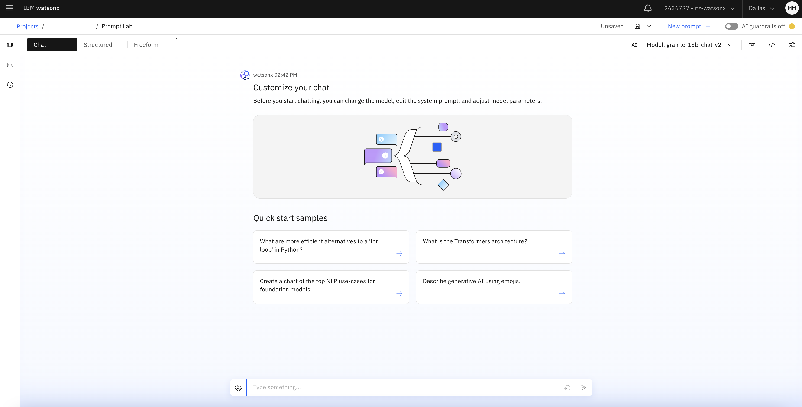

3. The **_Structured_** view is designed to help new users create effective prompts. The text from the fields - _Instruction_ and _Examples_ - is sent to the model in a template format.

   - Instruction: An instruction is an imperative statement for the model to follow (ex. Summarize the following article)
   - Examples: Add one or more pairs of examples (input AND output) to help the model learn. Providing a few examples of the input/output pair is called _few-shot prompting_.
   - Test your prompt: In the _Try_ area, you can test out your model and see the responses it will give.

   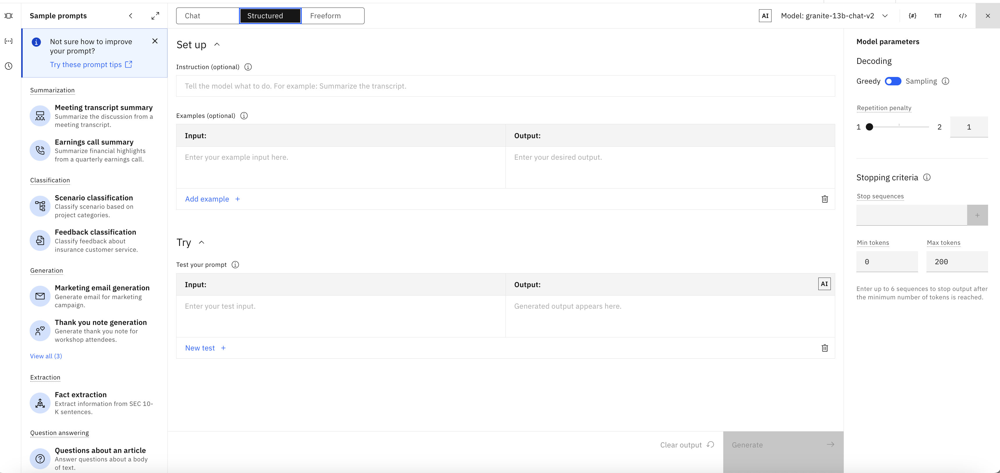

4. The **_Freeform_** view is a good choice when you want to submit a structured input and know how to format the prompt. You can simply add your prompt in plain text in the large text box as seen in the image below. Your prompt text will be sent to the model exactly as you type it.

   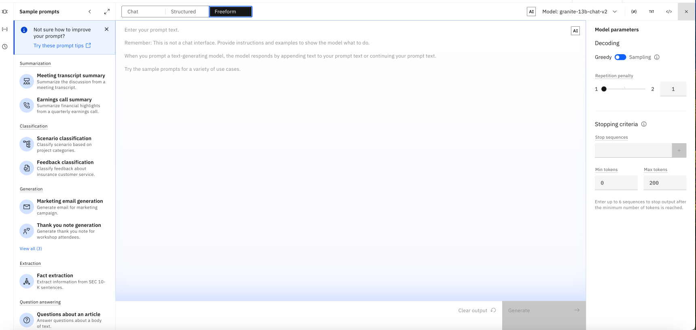

### **Step 5: Foundation Models**

1. In each of these view, the first step is choosing a model.

2. You can click on **model -> view all foundation models** and you can **select** your desired model from the model catalog.
   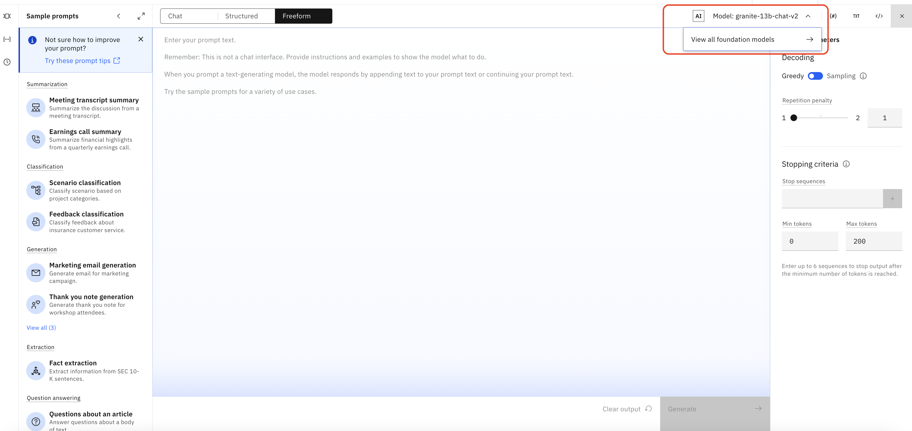
   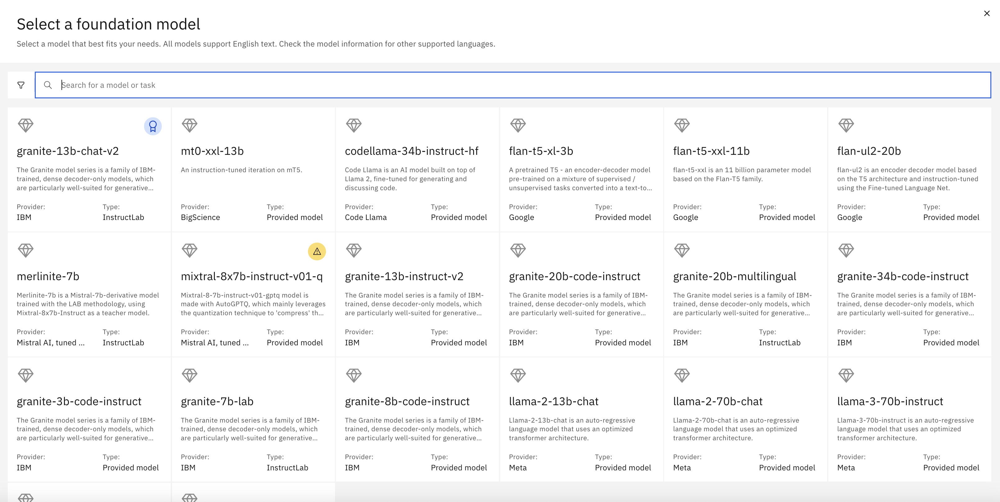
3. If you click on each of these models, you can see the model card which explains the details about the model and what tasks the model is good at. By reading the model card information, you can pick your model of choice.
   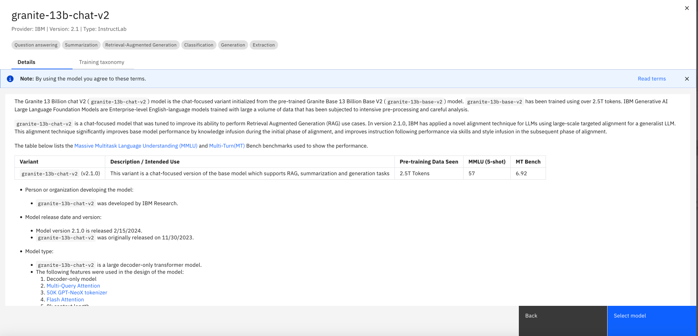

4. Once you picked the model, then you can choose different prompt templates and experiment with them, or modify them to match to your needs.

5. Click on model parameters icon in the top right corner. we can modify and try different model parameters and models to optimize it for your use case. If you would like to learn more about each input in the Model parameters panel, you can review [documentation](https://dataplatform.cloud.ibm.com/docs/content/wsj/analyze-data/fm-model-parameters.html?context=wx&audience=wdp). You can change the Max tokens to `500`. When LLMs process instructions and generate output, they convert words to tokens (a sequence of characters). While there isn’t a static ratio for letter to token conversion, we can use 10 words = 15 to 20 tokens as a rule of thumb for conversion.  
   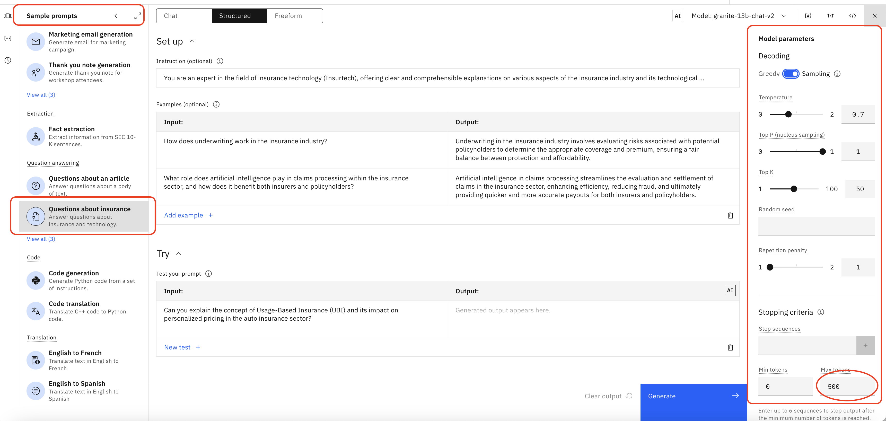

6. Working with LLMs requires experimentation and you can save your prompts, as a prompt template and use it later. In the Prompt Lab we can save the results of our experimentation with prompts

   - As a notebook
   - As a prompt
   - As a prompt session.

If we save our experimentation as a prompt session, we will be able to access various prompts and the output that was generated. In the Prompt Lab, select **Save work -> Save as -> Prompt session**. For more information check out this [documentation](https://dataplatform.cloud.ibm.com/docs/content/wsj/analyze-data/fm-prompt-save.html?context=wx&audience=wdp).
